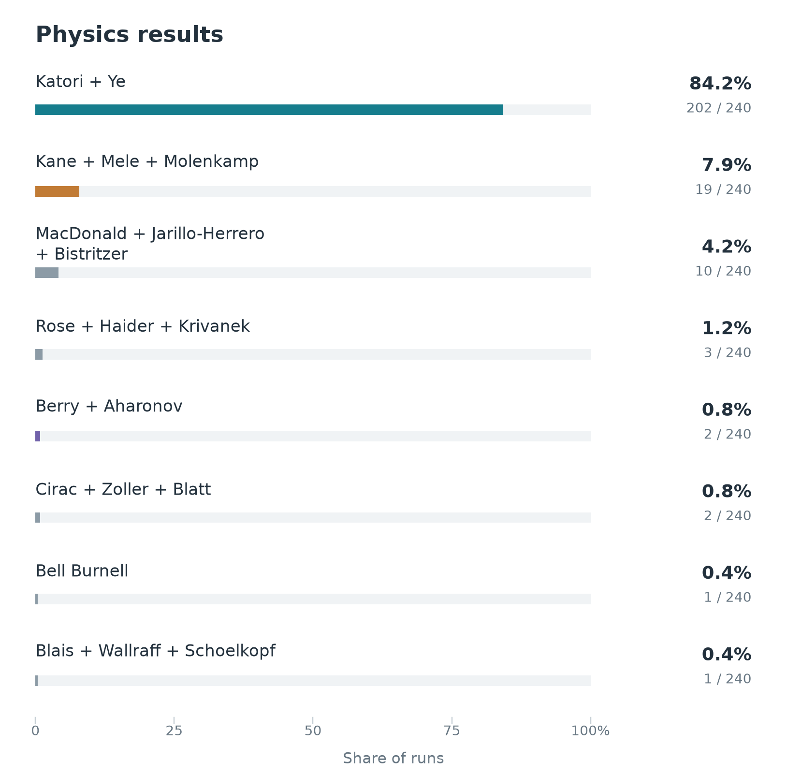
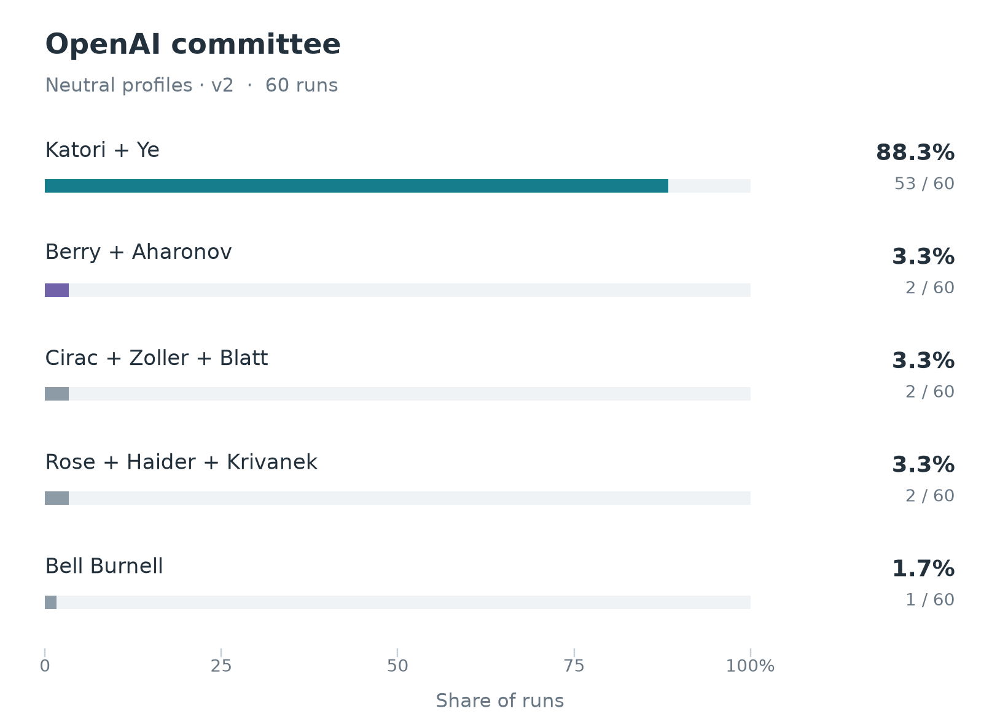
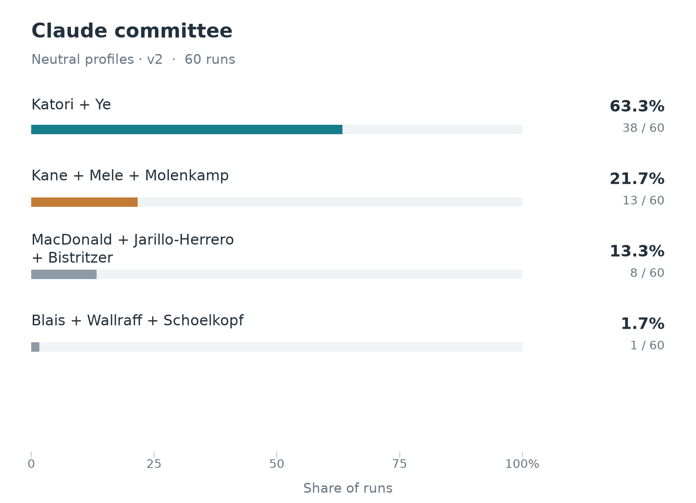
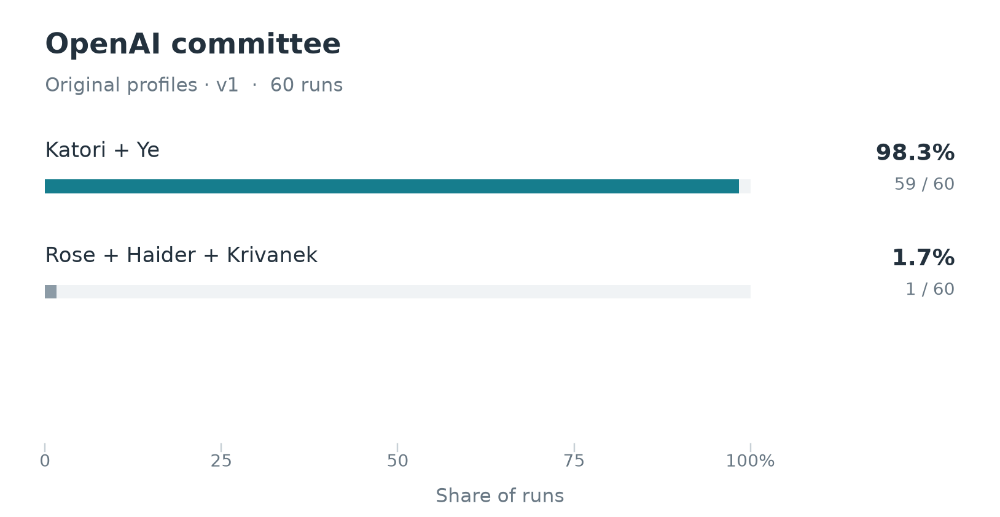
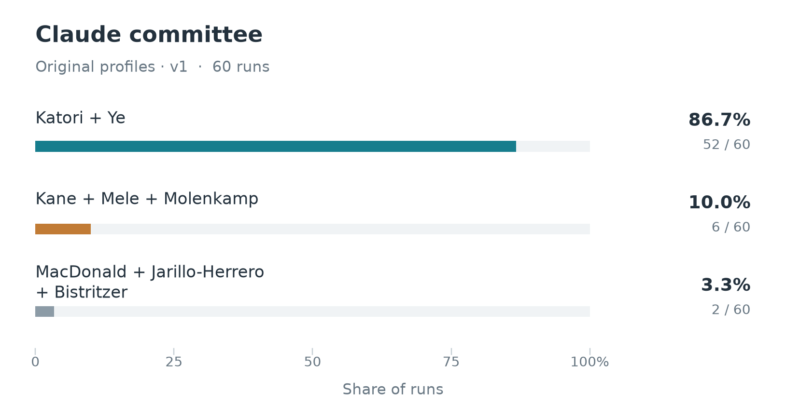
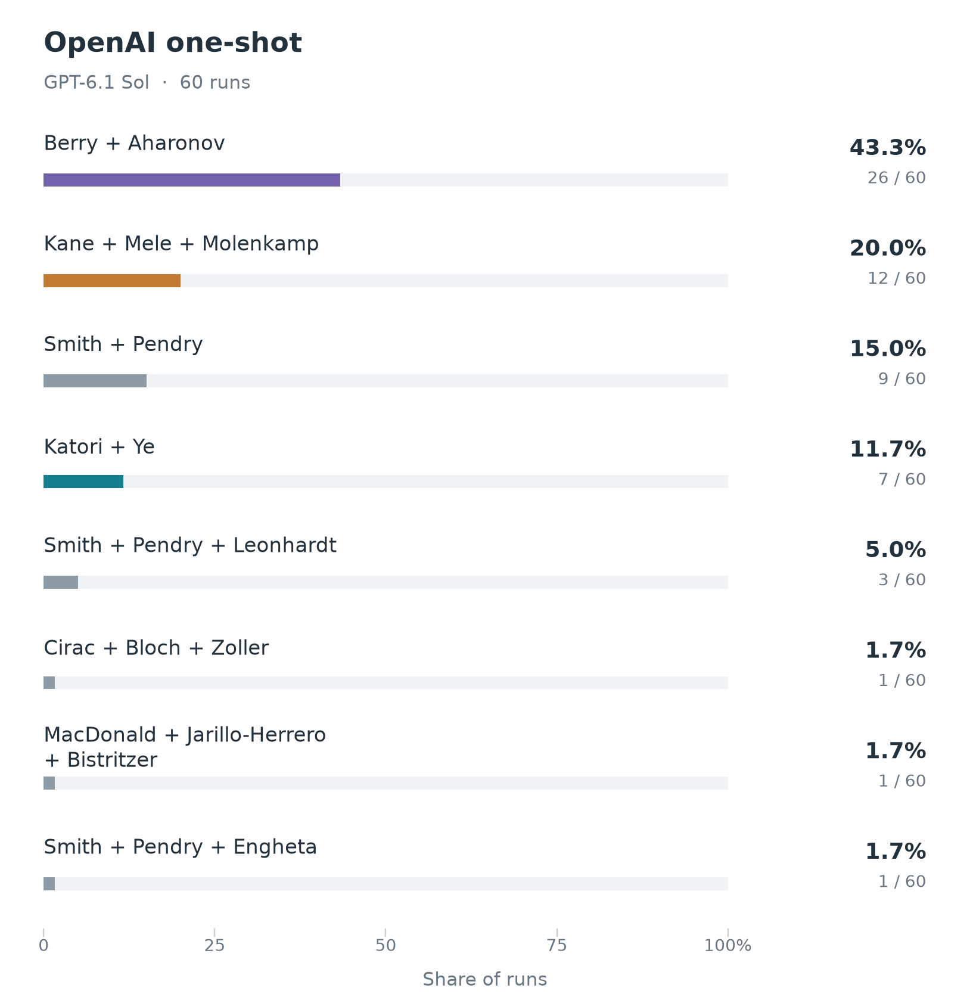
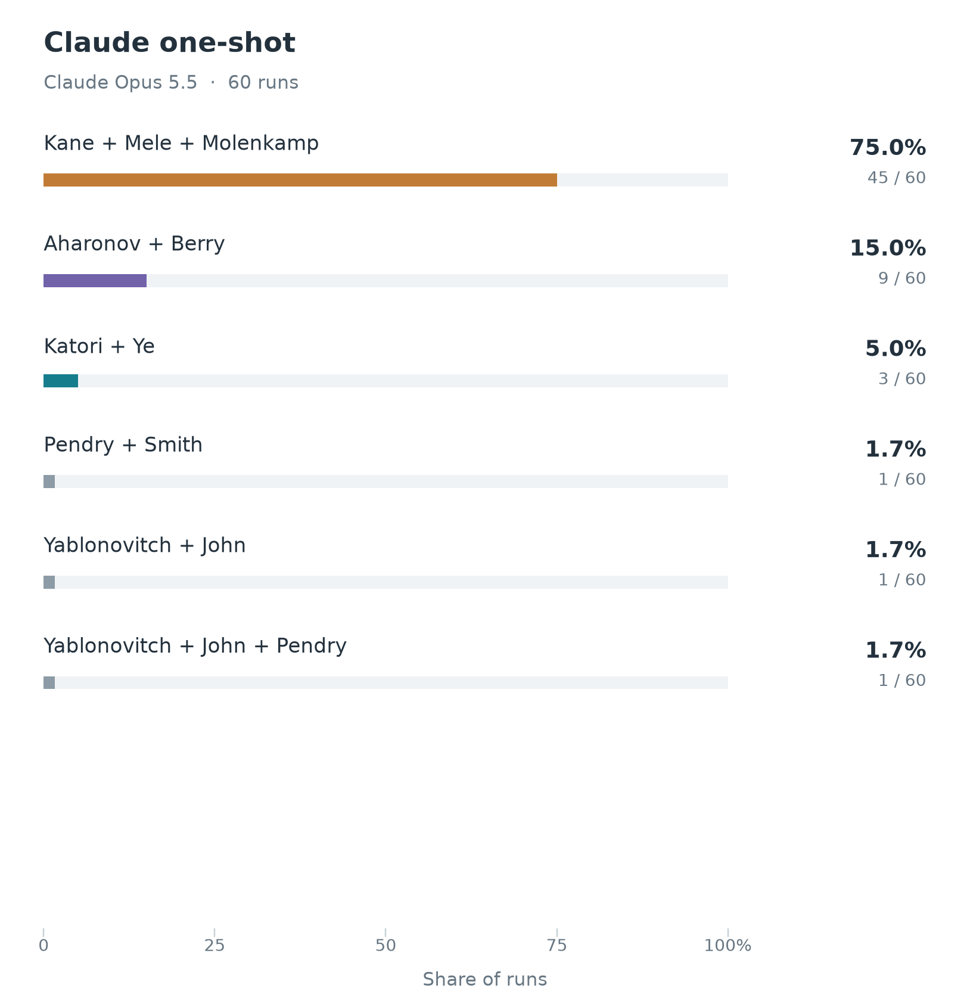

# Nobel Prize Forecasting 2026

We simulate Nobel Prize committee decisions to forecast the 2026 winners.

## Committee discussion

One agent per committee member reviews the candidates, participates in two discussion rounds, and casts a private ranked ballot. A majority decides the winner, with an instant runoff when needed. The [protocol](docs/PHYSICS_PHASE2.md) documents the voting rules and saved records.

## Results

### Physics

#### Proposed recognition

- **Hidetoshi Katori and Jun Ye** for optical lattice atomic clocks and precision timekeeping.
- **Charles L. Kane, Eugene J. Mele, and Laurens W. Molenkamp** for the theoretical prediction and experimental discovery of topological insulators and the quantum spin Hall effect.
- **Allan H. MacDonald, Pablo Jarillo-Herrero, and Rafi Bistritzer** for magic-angle twisted bilayer graphene and moiré flat-band quantum matter.
- **Harald Rose, Maximilian Haider, and Ondrej L. Krivanek** for aberration correction in electron microscopy, enabling sub-ångström imaging.
- **Michael Berry and Yakir Aharonov** for geometric phases and the role of electromagnetic potentials in quantum interference.
- **Ignacio Cirac, Peter Zoller, and Rainer Blatt** for quantum computation and simulation with trapped ions.
- **Jocelyn Bell Burnell** for the discovery of pulsars.
- **Alexandre Blais, Andreas Wallraff, and Robert J. Schoelkopf** for circuit quantum electrodynamics.

In the simulations, Kröll and Lindroth make a consistent case for clocks, drawing on overlapping expertise. Clocks also attract second-choice support as other members split among topological insulators, magic-angle graphene, IceCube, and other options.

#### Simulation variants

The result above pools four experiments: **GPT-5.6 Terra and Claude Sonnet 5.5, each with v1 and v2 profiles**. Each experiment combines 12 candidate lists and five fresh committees per list: **60 decisions per experiment, 240 in total**. Those lists come from six nomination runs for each of two independently drafted nominator lists.

**v1** uses the original member profiles. **v2** keeps documented expertise but removes inferred personality traits and selection preferences, aiming to bias the committees less. Candidate lists and discussion rules are unchanged. The plots show v2 first, then v1.

<table>
  <tr>
    <td align="center"></td>
    <td align="center"></td>
  </tr>
  <tr>
    <td align="center"></td>
    <td align="center"></td>
  </tr>
</table>

#### Appendix: one-shot comparison

For comparison, we asked **GPT-6.1 Sol and Claude Opus 5.5** who would win, without simulating a committee. Each graph summarizes 60 independent answers.

<table>
  <tr>
    <td align="center"></td>
    <td align="center"></td>
  </tr>
</table>

Additional slates appearing in this comparison:

- **John Pendry and David R. Smith** for electromagnetic metamaterials, negative refraction, and transformation optics.
- **John Pendry, David R. Smith, and Ulf Leonhardt** for metamaterials and transformation optics, including optical cloaking proposals.
- **John Pendry, David R. Smith, and Nader Engheta** for metamaterials and engineered electromagnetic response.
- **Ignacio Cirac, Immanuel Bloch, and Peter Zoller** for quantum simulation of many-body physics with ultracold atoms in optical lattices.
- **Eli Yablonovitch and Sajeev John** for photonic crystals and photonic band gaps that control light propagation.
- **Eli Yablonovitch, Sajeev John, and John Pendry** for photonic band-gap crystals and metamaterials for controlling light.

### Chemistry

Results pending.

### Physiology or Medicine

Results pending.

### Economic Sciences

Results pending.

### Peace

Results pending.
