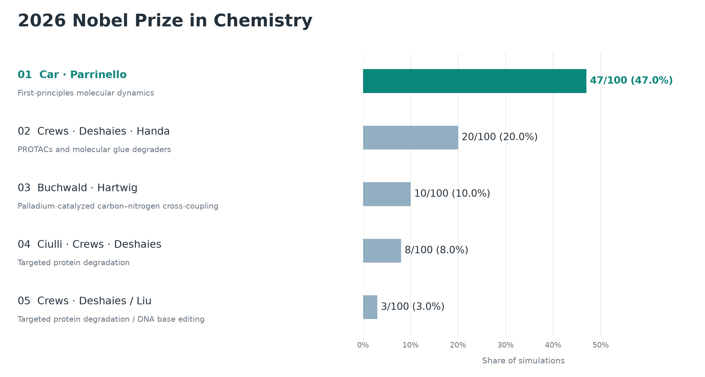
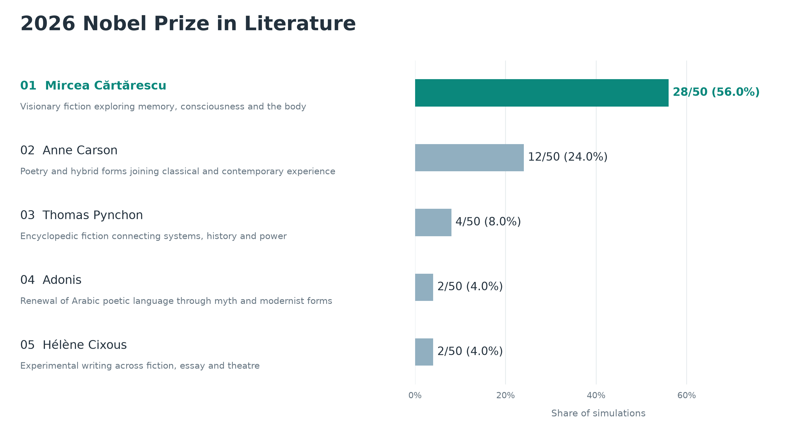
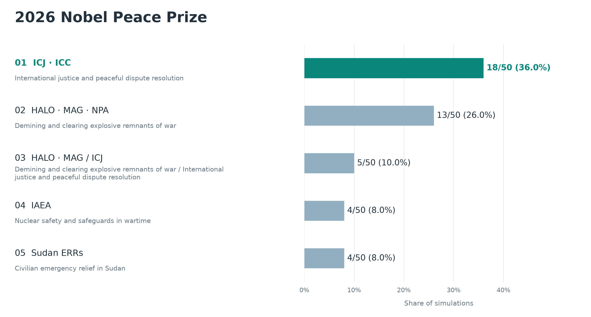

# Nobel Prize Forecasting 2026

We simulate Nobel Prize committee decisions to forecast the 2026 winners.

## Committee discussion

One agent per committee member reviews the candidates, participates in two discussion rounds, and casts a private ranked ballot. A majority decides the winner, with an instant runoff when needed. The [protocol](docs/PHYSICS_PHASE2.md) documents the voting rules and saved records.

**Caveat.** The committee is not the body that formally awards the prize: a larger assembly votes on its recommendation. That assembly almost always follows the committee, so simulating the committee is a good proxy for the decision. Literature is the exception, and our least reliable prediction: the final vote is taken by the 18 members of the Swedish Academy, of whom the Nobel Committee is only a small subset, and the other members vote independently and have overruled it.

## Results

### Physiology or Medicine

#### Proposed recognition

- **Daniel J. Drucker, Jens Juul Holst, and Svetlana Mojsov** for GLP-1 physiology and the development of incretin therapies for diabetes and obesity.
- **Ian H. Frazer, Douglas R. Lowy, and John T. Schiller** for virus-like particle vaccines that prevent HPV infection and related cancers.
- **Max D. Cooper and Jacques F. A. P. Miller** for discovering distinct B- and T-lymphocyte lineages and their roles in adaptive immunity.
- **Daniel J. Drucker, Jens Juul Holst, and Lotte Bjerre Knudsen** for GLP-1 physiology and the development of incretin therapies, with alternate credit for long-acting GLP-1 drugs.
- **F. Ulrich Hartl and Arthur L. Horwich** for chaperonin-assisted protein folding.

#### What the simulation analysis reveals

The aggregate combines **120 committee decisions** from Claude Sonnet 5.5 and GPT-5.6 Terra. GLP-1 wins 89 simulations (74.2%): 85 select Drucker, Holst, and Mojsov, while four substitute Lotte Bjerre Knudsen for Mojsov. HPV vaccines place second with 18 outcomes (15.0%). Five other discoveries account for the remaining 13 outcomes. These shares summarize the simulation results; they are not calibrated probabilities of winning the prize.

1. **Different starting judgments.** Claude is nearly unanimous for GLP-1 before discussion, while Terra divides mainly among GLP-1, HPV vaccines, and B- and T-cell lineages.
2. **Discussion consolidates support.** Terra usually strengthens the opening leader: HPV wins through strong consensus, while GLP-1 also wins through second-choice transfers. Within GLP-1, the remaining disagreement is whether Mojsov or Knudsen receives the third seat.

#### Forecast versus the announced prize

The 2026 Nobel Prize in Physiology or Medicine has now been awarded to Karl Deisseroth, Peter Hegemann, and Georg Nagel “for their discoveries concerning light-gated ion channels and optogenetics.”

One input to our simulations was a curated list of plausible discoveries and potential laureates. That list included optogenetics and all three eventual winners. Furthermore, optogenetics was shortlisted in 84 of 120 simulations and reached the final vote once, with the exact winning trio. However, it did not win any simulation.

A plausible explanation is a recency and salience bias toward GLP-1 in the underlying models. GLP-1 won 89 of 120 committee simulations, while the independent one-shot forecasts selected it in 60 of 60 Claude Opus 5.5 predictions and 58 of 60 GPT-6 Sol predictions. This agreement suggests that the simulated agents inherited some models’ bias toward GLP-1 and that the committee role-playing did not make much difference.

For details, check [the Medicine experiments](results/medicine/README.md).

### Physics

#### Proposed recognition

- **Hidetoshi Katori and Jun Ye** for optical lattice atomic clocks and precision timekeeping.
- **Charles L. Kane, Eugene J. Mele, and Laurens W. Molenkamp** for the theoretical prediction and experimental discovery of topological insulators and the quantum spin Hall effect.
- **Allan H. MacDonald, Pablo Jarillo-Herrero, and Rafi Bistritzer** for magic-angle twisted bilayer graphene and moiré flat-band quantum matter.
- **Michael Berry and Yakir Aharonov** for geometric phases and the role of electromagnetic potentials in quantum interference.
- **Harald Rose, Maximilian Haider, and Ondrej L. Krivanek** for aberration correction in electron microscopy, enabling sub-ångström imaging.

#### What the simulation analysis reveals

The aggregate combines **300 committee decisions** from GPT-5.6 Terra, Claude Sonnet 5.5, and GPT-6 Luna, using both factual profiles and profiles that also include inferred traits. Optical lattice clocks win 236 simulations (78.7%). Topological insulators place second with 22 outcomes (7.3%), and magic-angle twisted bilayer graphene places third with 10 (3.3%). Nineteen other configurations account for the remaining 32 outcomes. These shares summarize the simulation results; they are not calibrated probabilities of winning the prize.

1. **The leading result is robust across models and profile variants.** Optical lattice clocks win 53 of 60 Terra decisions with factual profiles, 38 of 60 Claude decisions with factual profiles, 59 of 60 Terra decisions with inferred-trait profiles, 52 of 60 Claude decisions with inferred-trait profiles, and 34 of 60 Luna decisions with inferred-trait profiles.
2. **Two committee members make a consistent case for clocks.** Kröll and Lindroth often rank optical lattice clocks first. Their research backgrounds overlap with the atomic and precision-measurement physics behind Katori and Ye's work, so they reinforce one another's case for the achievement's maturity, distinctiveness, and attribution.
3. **Clocks are a strong second choice for most of the other members.** The remaining first choices divide among topological insulators, magic-angle graphene, IceCube, and other candidates. The case made by Kröll and Lindroth helps turn clocks' broad second-choice support into a majority during discussion and ranked-vote transfers.
4. **Luna broadens the long tail.** Its 60 committees produce 21 distinct winning configurations, compared with eight across the four Terra and Claude experiments. Luna adds three topological-insulator outcomes and 14 configurations that do not win in the other arms.

#### Forecast versus the announced prize

The [2026 Nobel Prize in Physics](https://www.nobelprize.org/prizes/physics/2026/summary/) has now been awarded to Francis Halzen “for his decisive contributions to the IceCube Neutrino Observatory and to the discovery of high-energy neutrinos of astrophysical origin.”

IceCube was available to all 300 simulated committees, reached the shortlist in **233 of 300 simulations (77.7%)**, and was ranked first by at least one committee member in **203 (67.7%)**. It reached the final proposal slate in **27 simulations (9.0%)**, but was not selected. None of the 120 independent one-shot forecasts selected Halzen.

The saved deliberations show a consistent pattern: agents praised IceCube for opening a new observational window, but repeatedly objected to awarding a collaboration-scale discovery to Halzen alone. The announced prize resolved that attribution question in Halzen's favor, while the simulations placed greater weight on credit allocation.

For details, including the full outcome distribution and an example committee discussion, check [the Physics experiments](results/physics/README.md).

### Chemistry

**Reliability warning.** These Chemistry results appear very unreliable. The aggregate's leading prediction, Car–Parrinello molecular dynamics, is driven almost exclusively by GPT-5.6 Terra: it accounts for 46 of the 47 wins, while Claude mostly favors targeted protein degradation. The pooled ranking therefore reflects conflicting model preferences rather than agreement across models.

#### Proposed recognition

- **Roberto Car and Michele Parrinello** for first-principles molecular dynamics by the Car–Parrinello method.
- **Craig M. Crews, Raymond J. Deshaies, and Hiroshi Handa** for targeted protein degradation by PROTACs and molecular glue degraders.
- **Stephen L. Buchwald and John F. Hartwig** for palladium-catalyzed carbon–nitrogen cross-coupling.
- **Alessio Ciulli, Craig M. Crews, and Raymond J. Deshaies** for targeted protein degradation, with alternate credit for the third laureate.
- **Craig M. Crews and Raymond J. Deshaies / David R. Liu** for a split prize recognizing targeted protein degradation and programmable DNA base editing.

#### What the simulation analysis reveals

The aggregate combines **100 committee decisions** from GPT-5.6 Terra and Claude Sonnet 5.5, with 50 simulations per model. Car–Parrinello molecular dynamics wins 47 simulations (47%). Targeted protein degradation wins 28 (28%): 20 select Crews, Deshaies, and Handa, while eight select Ciulli, Crews, and Deshaies. Buchwald–Hartwig coupling wins ten (10%). Eight other configurations account for the remaining 15 outcomes. These shares summarize the simulation results; they are not calibrated probabilities of winning the prize.

1. **The models favor different discoveries.** Terra selects Car and Parrinello in 46 of 50 decisions (92%); Claude selects them once. Claude selects targeted protein degradation in 28 decisions, plus four split prizes with base editing; Terra never selects it. Both candidate pools include both leading discoveries, but Terra uses 52 candidates and Claude 69, with different profile allocations, so this is not a controlled comparison of models alone.
2. **Terra's leading result persists across five neutral profile versions.** Car–Parrinello wins between 88.9% and 100% of each version's simulations. Giving the five versions equal weight yields 91.8%, close to the pooled 92%.
3. **Claude's degradation outcomes differ mainly in credit.** Its 28 standalone awards all include Crews and Deshaies; Handa takes the third seat in 20 and Ciulli in eight. The models overlap on Buchwald–Hartwig coupling, which wins three Terra and seven Claude simulations.

For details, including the full outcome distribution and model-specific figures, check [the Chemistry experiments](results/chemistry/README.md).

### Literature

#### Proposed recognition

- **Mircea Cărtărescu** for visionary fiction exploring memory, consciousness and the body.
- **Anne Carson** for inventive poetry and hybrid forms joining classical literature with contemporary experience.
- **Thomas Pynchon** for encyclopedic fiction connecting systems of power, scientific knowledge and historical consciousness.
- **Adonis** for renewing Arabic poetic language through myth and modernist forms.
- **Hélène Cixous** for experimental writing across fiction, essay and theatre.

#### What the simulation analysis reveals

The aggregate combines **50 committee decisions**: 25 each from GPT-5.6 Terra and Claude Sonnet 5.5, using the same 50-writer list, five neutral profile versions and paired candidate shuffles. Mircea Cărtărescu wins 28 simulations (56%), Anne Carson 12 (24%), and Thomas Pynchon four (8%). Adonis and Hélène Cixous each win two; Can Xue and Gerald Murnane each win one. These shares summarize the simulations and are not calibrated probabilities of the actual prize.

1. **Both committees favor Cărtărescu, with different levels of agreement.** He wins 19/25 Claude and 9/25 Terra simulations. Terra nearly splits between him and Carson, who wins eight. Claude ranks Cărtărescu first in 98/150 private opening rankings; Terra does so in 52/150.
2. **Profile presentation changes the spread.** Claude’s leading writer remains Cărtărescu across all five versions, while Terra’s third version produces no Cărtărescu selections despite retaining the same factual record.
3. **The one-shot forecasts point elsewhere.** GPT-6.1 Sol chooses Can Xue in 23/25 direct forecasts, while Claude Opus 5.5 chooses Anne Carson in 21/25. The change in both model and context prevents attributing this difference solely to deliberation.

These committees predict a recommendation; the full Swedish Academy’s final vote is not simulated. For all outcomes, model comparisons, saved records and the one-shot results, see [the Literature experiments](results/literature/README.md).

### Peace

#### Proposed recognition

- **International Court of Justice and International Criminal Court** for peaceful dispute resolution and accountability for atrocity crimes.
- **HALO Trust, Mines Advisory Group, and Norwegian People's Aid** for demining and clearing explosive remnants of war to protect civilians.
- **HALO Trust and Mines Advisory Group / International Court of Justice** for a split prize recognizing demining and peaceful dispute resolution.
- **International Atomic Energy Agency** for nuclear safety and safeguards in wartime.
- **Sudan's Emergency Response Rooms** for volunteer-led civilian relief during Sudan's civil war.

#### What the simulation analysis reveals

The aggregate combines **50 committee decisions**: 25 each from GPT-5.6 Terra and Claude Sonnet 5.5, using the same 47-entry candidate list and five neutral profile versions. The ICJ–ICC pair wins 18 simulations (36%), the three demining organizations win 13 (26%), and the split ICJ/demining award wins five (10%). IAEA and Sudan's Emergency Response Rooms each win four (8%); five other configurations account for the remaining six decisions. These shares summarize simulation outcomes; they are not calibrated probabilities of winning the prize.

1. **The models favor different approaches to peace.** All 18 ICJ–ICC outcomes come from Claude. Terra supplies 12 of the 13 three-organization demining outcomes and every standalone IAEA or Sudan outcome. Both models use identical candidates, profile versions, and paired list shuffles.
2. **Demining is the main area of overlap.** It appears in 22 of 50 winning configurations: 15 Terra and seven Claude decisions, including shared awards. Recognition of the international courts appears in 23 decisions, all Claude.
3. **Profile presentation affects the spread of results.** With the fifth version, all five Terra committees choose the demining trio and all five Claude committees choose the ICJ–ICC pair. Earlier versions produce a broader mix despite containing the same retained facts and public statements.

For details, including the full distribution, model-specific figures and independent one-shot comparison, check [the Peace experiments](results/peace/README.md).

### Economic Sciences

Prediction to be announced.
