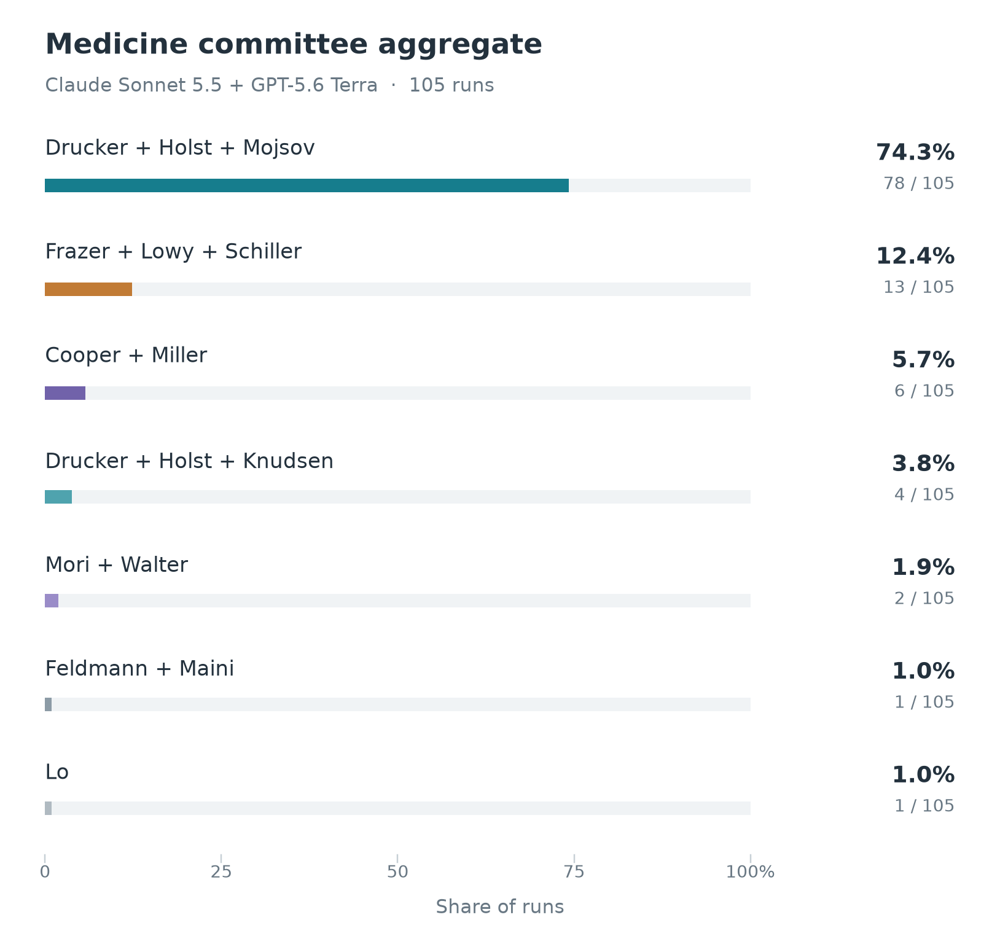

# Nobel Prize Forecasting 2026

We simulate Nobel Prize committee decisions to forecast the 2026 winners.

## Committee discussion

One agent per committee member reviews the candidates, participates in two discussion rounds, and casts a private ranked ballot. A majority decides the winner, with an instant runoff when needed. The [protocol](docs/PHYSICS_PHASE2.md) documents the voting rules and saved records.

**Caveat.** The committee is not the body that formally awards the prize: a larger assembly votes on its recommendation. That assembly almost always follows the committee, so simulating the committee is a good proxy for the decision. Literature is the exception, and our least reliable prediction: the final vote is taken by the 18 members of the Swedish Academy, of whom the Nobel Committee is only a small subset, and the other members vote independently and have overruled it.

## Results

### Physiology or Medicine

#### Proposed recognition

- **Daniel J. Drucker, Jens Juul Holst, and Svetlana Mojsov** for GLP-1 physiology and the development of incretin therapies for diabetes and obesity.
- **Ian H. Frazer, Douglas R. Lowy, and John T. Schiller** for virus-like particle vaccines that prevent HPV infection and related cancers.
- **Max D. Cooper and Jacques F. A. P. Miller** for discovering distinct B- and T-lymphocyte lineages and their roles in adaptive immunity.
- **Daniel J. Drucker, Jens Juul Holst, and Lotte Bjerre Knudsen** for GLP-1 physiology and the development of incretin therapies, with alternate credit for long-acting GLP-1 drugs.
- **F. Ulrich Hartl and Arthur L. Horwich** for chaperonin-assisted protein folding.
- **Kazutoshi Mori and Peter Walter** for the unfolded protein response and signaling from the endoplasmic reticulum.
- **Marc Feldmann and Ravinder N. Maini** for TNF blockade as a treatment for rheumatoid arthritis and inflammatory disease.
- **Y. M. Dennis Lo** for fetal cell-free DNA in maternal blood and noninvasive prenatal screening.

#### What the simulation analysis reveals

The aggregate combines **120 committee decisions** from Claude Sonnet 5.5 and GPT-5.6 Terra. GLP-1 wins 89 decisions (74.2%): 85 select Drucker, Holst, and Mojsov, while four substitute Lotte Bjerre Knudsen for Mojsov. HPV vaccines place second with 18 decisions (15.0%). Five other discoveries account for the remaining 13 decisions.

1. **Different starting judgments.** Claude is nearly unanimous for GLP-1 before discussion, while Terra divides mainly among GLP-1, HPV vaccines, and B- and T-cell lineages.
2. **Discussion consolidates support.** Terra usually strengthens the opening leader: HPV wins through strong consensus, while GLP-1 also wins through second-choice transfers. Within GLP-1, the remaining disagreement is whether Mojsov or Knudsen receives the third seat.

For details, check [the Medicine experiments](results/medicine/README.md).

### Physics

Prediction to be announced.

### Chemistry

Prediction to be announced.

### Peace

Prediction to be announced.

### Economic Sciences

Prediction to be announced.
