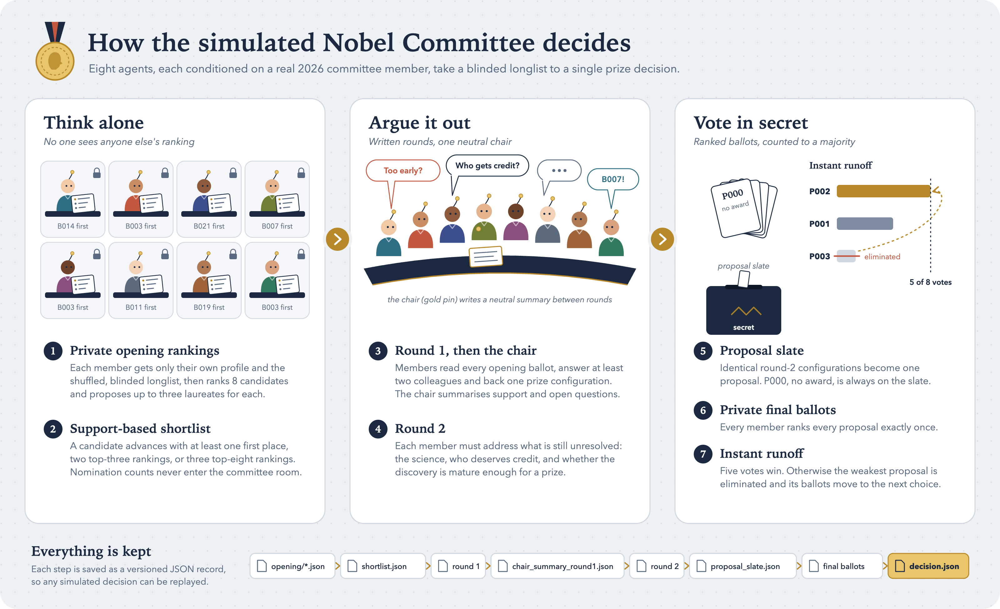
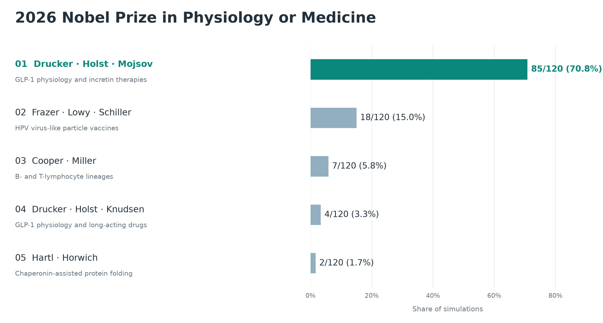
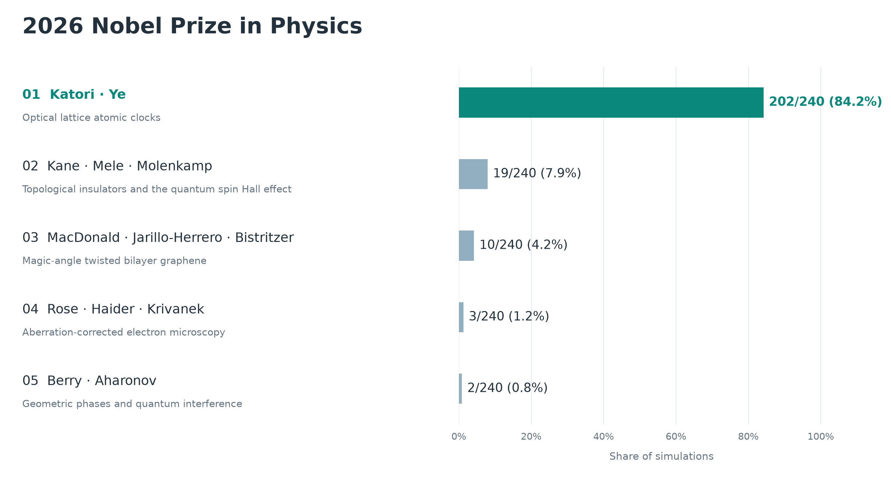

# Nobel Prize Forecasting 2026

We simulate Nobel Prize committee decisions to forecast the 2026 winners.

## Committee discussion

One agent per committee member reviews the candidates, participates in two discussion rounds, and casts a private ranked ballot. A majority decides the winner, with an instant runoff when needed. The [protocol](docs/PHYSICS_PHASE2.md) documents the voting rules and saved records.

**Caveat.** The committee is not the body that formally awards the prize: a larger assembly votes on its recommendation. That assembly almost always follows the committee, so simulating the committee is a good proxy for the decision. Literature is the exception, and our least reliable prediction: the final vote is taken by the 18 members of the Swedish Academy, of whom the Nobel Committee is only a small subset, and the other members vote independently and have overruled it.

## Results

### Physiology or Medicine

#### Proposed recognition

- **Daniel J. Drucker, Jens Juul Holst, and Svetlana Mojsov** for GLP-1 physiology and the development of incretin therapies for diabetes and obesity.
- **Ian H. Frazer, Douglas R. Lowy, and John T. Schiller** for virus-like particle vaccines that prevent HPV infection and related cancers.
- **Max D. Cooper and Jacques F. A. P. Miller** for discovering distinct B- and T-lymphocyte lineages and their roles in adaptive immunity.
- **Daniel J. Drucker, Jens Juul Holst, and Lotte Bjerre Knudsen** for GLP-1 physiology and the development of incretin therapies, with alternate credit for long-acting GLP-1 drugs.
- **F. Ulrich Hartl and Arthur L. Horwich** for chaperonin-assisted protein folding.
- **Kazutoshi Mori and Peter Walter** for the unfolded protein response and signaling from the endoplasmic reticulum.
- **Marc Feldmann and Ravinder N. Maini** for TNF blockade as a treatment for rheumatoid arthritis and inflammatory disease.
- **Y. M. Dennis Lo** for fetal cell-free DNA in maternal blood and noninvasive prenatal screening.

#### What the simulation analysis reveals

The aggregate combines **120 committee decisions** from Claude Sonnet 5.5 and GPT-5.6 Terra. GLP-1 wins 89 simulations (74.2%): 85 select Drucker, Holst, and Mojsov, while four substitute Lotte Bjerre Knudsen for Mojsov. HPV vaccines place second with 18 outcomes (15.0%). Five other discoveries account for the remaining 13 outcomes. These shares summarize the simulation results; they are not calibrated probabilities of winning the prize.

1. **Different starting judgments.** Claude is nearly unanimous for GLP-1 before discussion, while Terra divides mainly among GLP-1, HPV vaccines, and B- and T-cell lineages.
2. **Discussion consolidates support.** Terra usually strengthens the opening leader: HPV wins through strong consensus, while GLP-1 also wins through second-choice transfers. Within GLP-1, the remaining disagreement is whether Mojsov or Knudsen receives the third seat.

#### Forecast versus the announced prize

The 2026 Nobel Prize in Physiology or Medicine has now been awarded to Karl Deisseroth, Peter Hegemann, and Georg Nagel “for their discoveries concerning light-gated ion channels and optogenetics.”

One input to our simulations was a curated list of plausible discoveries and potential laureates. That list included optogenetics and all three eventual winners. Furthermore, optogenetics was shortlisted in 84 of 120 simulations and reached the final vote once, with the exact winning trio. However, it did not win any simulation.

A plausible explanation is a recency and salience bias toward GLP-1 in the underlying models. GLP-1 won 89 of 120 committee simulations, while the independent one-shot forecasts selected it in 60 of 60 Claude Opus 5.5 predictions and 58 of 60 GPT-6 Sol predictions. This agreement suggests that the simulated agents inherited some models’ bias toward GLP-1 and that the committee role-playing did not make much difference.

For details, check [the Medicine experiments](results/medicine/README.md).

### Physics

#### Proposed recognition

- **Hidetoshi Katori and Jun Ye** for optical lattice atomic clocks and precision timekeeping.
- **Charles L. Kane, Eugene J. Mele, and Laurens W. Molenkamp** for the theoretical prediction and experimental discovery of topological insulators and the quantum spin Hall effect.
- **Allan H. MacDonald, Pablo Jarillo-Herrero, and Rafi Bistritzer** for magic-angle twisted bilayer graphene and moiré flat-band quantum matter.
- **Harald Rose, Maximilian Haider, and Ondrej L. Krivanek** for aberration correction in electron microscopy, enabling sub-ångström imaging.
- **Michael Berry and Yakir Aharonov** for geometric phases and the role of electromagnetic potentials in quantum interference.
- **Ignacio Cirac, Peter Zoller, and Rainer Blatt** for quantum computation and simulation with trapped ions.
- **Jocelyn Bell Burnell** for the discovery of pulsars.
- **Alexandre Blais, Andreas Wallraff, and Robert J. Schoelkopf** for circuit quantum electrodynamics.

#### What the simulation analysis reveals

The aggregate combines **240 committee decisions** from GPT-5.6 Terra and Claude Sonnet 5.5, using both factual profiles and profiles that also include inferred traits. Optical lattice clocks win 202 simulations (84.2%). Topological insulators place second with 19 outcomes (7.9%), and magic-angle twisted bilayer graphene places third with 10 (4.2%). Five other configurations account for the remaining nine outcomes. These shares summarize the simulation results; they are not calibrated probabilities of winning the prize.

1. **The leading result is robust across models and profile variants.** Optical lattice clocks win 53 of 60 Terra decisions with factual profiles, 38 of 60 Claude decisions with factual profiles, 59 of 60 Terra decisions with inferred-trait profiles, and 52 of 60 Claude decisions with inferred-trait profiles.
2. **Most disagreement comes from the Claude committees.** The two Claude experiments produce all 19 topological-insulator outcomes and all 10 magic-angle-graphene outcomes, while the Terra experiments account for the lower-frequency alternatives.

For details, including the full outcome distribution and an example committee discussion, check [the Physics experiments](results/physics/README.md).

### Chemistry

Prediction to be announced.

### Peace

Prediction to be announced.

### Economic Sciences

Prediction to be announced.
