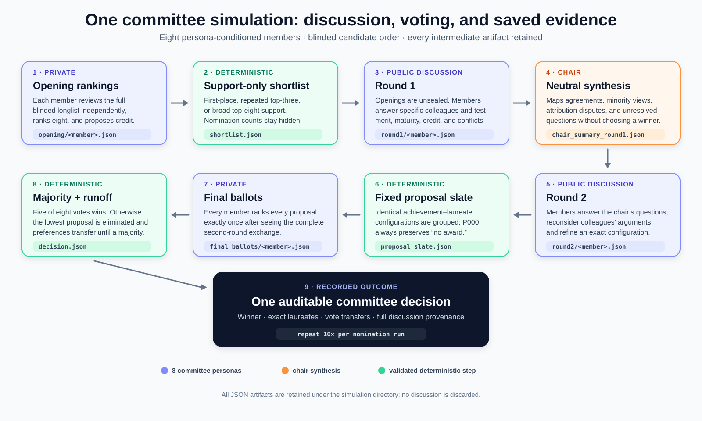

# Nobel Prize Forecasting 2026

Forecast the 2026 Nobel Prizes by **simulating the nominations and the committee deliberations** and aggregating the outcomes over many runs.

## Idea

The simulation mirrors the real process in two stages.

1. **Nomination.** 100 nominator agents, each conditioned on a real physicist's `profile.md`, submit one nomination each. Nominations are merged into a candidate list.
2. **Committee.** One agent per real committee member, each conditioned on that member's `profile.md`, reviews the complete merged longlist, deliberates and votes. The simulation treats the committee decision as the outcome and omits the later Physics Class and Academy ratification.

Profiles (`agent-data/PROFILE_TEMPLATE.md`, `agent-data/NOMINATOR_PROFILE_TEMPLATE.md`) describe expertise and taste but deliberately contain no nominations or predictions.

Each stage is repeated over several runs; the share of runs a candidate wins is its forecast probability. Scope: Physics first, then Chemistry, Medicine, Economics, Peace (Literature dropped: its real decision is a second vote by the full Swedish Academy).

```
nominator agents ──► nominations ──► candidate list ──► committee agents ──► deliberation ──► ballot ──► winner
                                                                                                         │
                                                         × runs ──► win probabilities ◄──────────────────┘
```

## Committee discussion workflow



Every opening assessment, member statement, chair summary, proposal slate,
private ballot, runoff transfer, and final decision is saved as a versioned JSON
artifact. The complete protocol and schemas are documented in
[`docs/PHYSICS_PHASE2.md`](docs/PHYSICS_PHASE2.md).

## Categories

| Folder | Prize | Deciding body (real world) |
|---|---|---|
| `agent-data/physics/` | Physics | Nobel Committee for Physics → Royal Swedish Academy of Sciences |
| `agent-data/chemistry/` | Chemistry | Nobel Committee for Chemistry → Royal Swedish Academy of Sciences |
| `agent-data/medicine/` | Physiology or Medicine | Nobel Committee → Nobel Assembly at Karolinska Institutet |
| `agent-data/literature/` | Literature | Nobel Committee → Swedish Academy |
| `agent-data/peace/` | Peace | Norwegian Nobel Committee |
| `agent-data/economics/` | Economic Sciences (Riksbank Prize) | Committee for the Prize → Royal Swedish Academy of Sciences |

> Modeling choice: in most categories a small committee proposes and a larger body formally decides. The baseline simulation treats the committee as the effective deciding body and omits the ratifying stage. This is an explicit simplification, not a claim that the committee is the legal prize-awarder.

## Repository layout

```
agent-data/<category>/
  committee/<member-slug>/   one folder per committee member (profile.md)
  nominators/<list-id>/      one folder per nominator list, named after the model that drafted it
    nominators.csv           the 100 nominators
    list_note.md             how the list was drafted
    <slug>/profile.md        one profile per nominator (NOMINATOR_PROFILE_TEMPLATE.md)
scripts/                     orchestration
results/<category>/<list-id>/
  run-<n>/nominations/       raw nominations from one nomination run
  run-<n>/candidates.csv     merged candidate list for that run
  run-<n>/committee/         committee transcript, ballots, winner
  summary.csv                win share per candidate across runs
```

## Pipeline

Agents are run through a documented orchestration workflow, each given only the evidence needed for its role. Model identifiers, prompts and reasoning settings are recorded with the outputs.

1. **Nominator list:** a model drafts 100 nominators matching the eligible nominator groups, countries and subfields (`scripts/generate_nominator_list.py`, or a subagent). Physics has lists drafted by Claude Opus 5.5 and GPT-6 Sol.
2. **Nominator profiles:** each nominator gets a web-researched `profile.md` (checked alive and current affiliation; biography, research footprint, persona; no nominations or predictions).
3. **Nomination:** 6 runs per nominator list × 100 nominator subagents (`scripts/nominations.workflow.js`). Each run's nominations are consolidated without frequency-based exclusion into `candidates.json` and `candidates.csv`.
4. **Committee:** for each complete run, persona-conditioned member agents give private opening rankings, form a support-based union shortlist, hold two written discussion rounds, and rank a fixed proposal slate by secret ballot. Candidate order is deterministically shuffled and nomination-frequency signals are hidden. Five votes decide; otherwise a fully recorded instant runoff is used.

The versioned Physics phase-2 methodology is in `docs/PHYSICS_PHASE2.md`.
