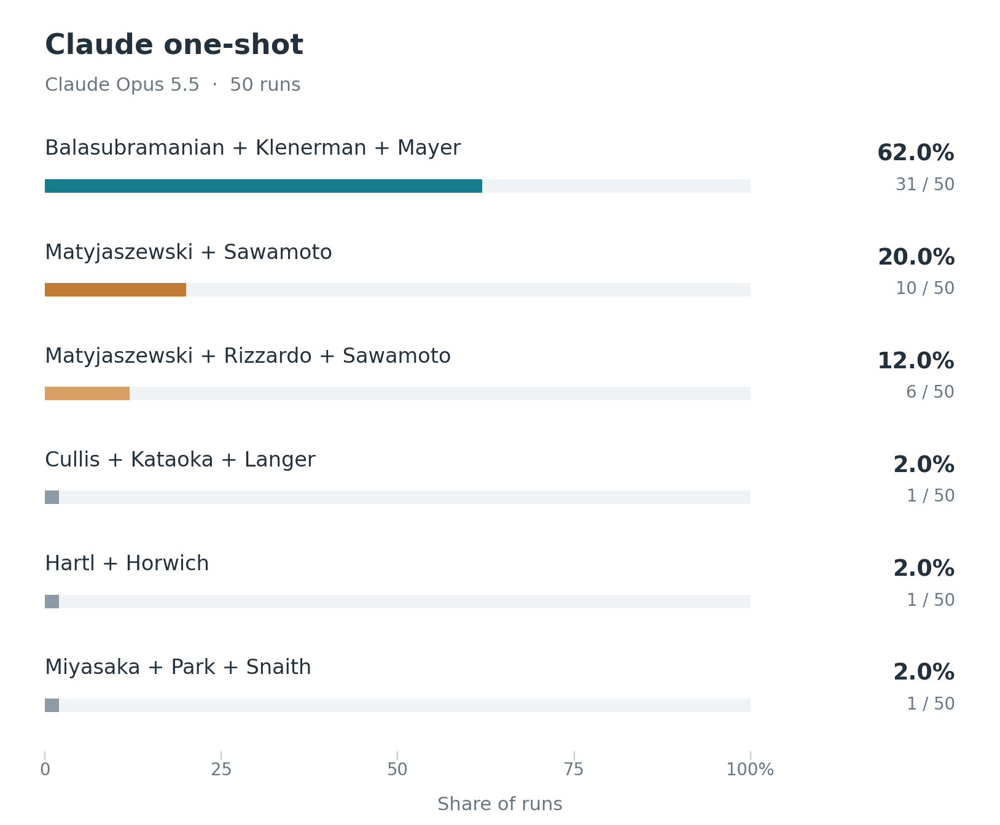
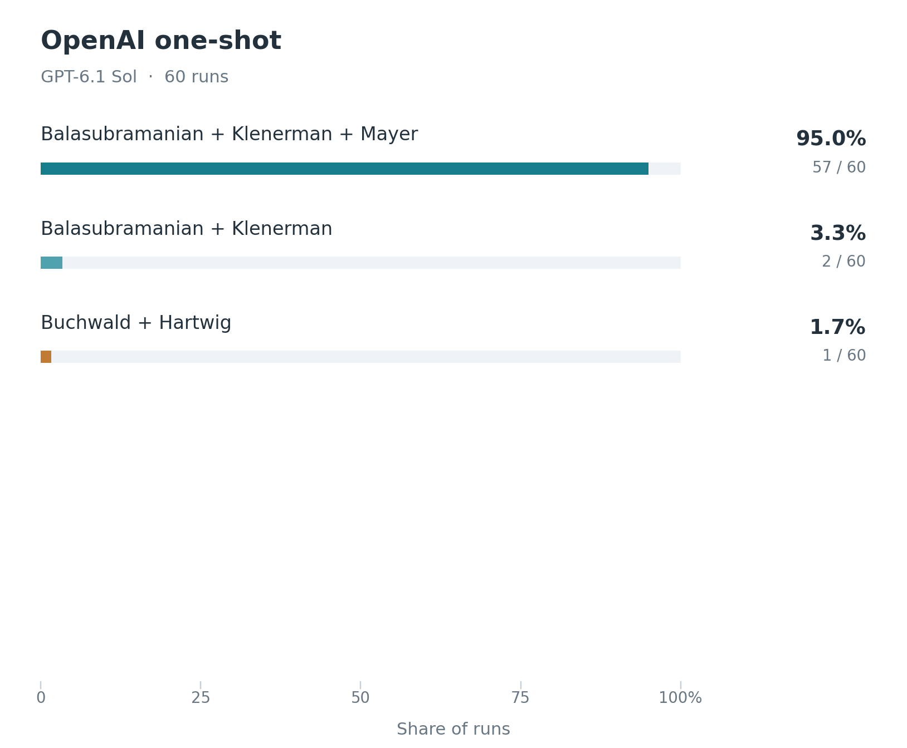

# Chemistry experiment details

**Reliability warning.** These Chemistry results appear very unreliable. The aggregate's leading prediction, Car–Parrinello molecular dynamics, is driven almost exclusively by GPT-5.6 Terra: it accounts for 46 of the 47 wins, while Claude mostly favors targeted protein degradation. The pooled ranking therefore reflects conflicting model preferences rather than agreement across models.

## Aggregate simulation outcomes

The figure below shows all 12 winning configurations across the **100 committee simulations** pooled in the main forecast. Each model contributes 50 decisions. Counts and percentages are observed simulation outcomes, not calibrated probabilities of winning the prize. Split awards remain separate configurations; a slash separates their prize parts.


The main forecast shows five configurations. The fifth, Crews–Deshaies / Liu, is tied at three wins with Gaudelli–Komor–Liu; alphabetical label order breaks ties, as in the other forecast figures. Both appear in the full distribution.

## Simulation variants

The [Chemistry result](../../README.md#chemistry) aggregates **50 GPT-5.6 Terra and 50 Claude Sonnet 5.5 decisions**, both using high reasoning effort. Eight simulated committee members review a shuffled candidate list, take part in two discussion rounds, and cast ranked private ballots. All eight vote; a majority is five. Conflicts are disclosed but not adjudicated. The [protocol](../../docs/PHYSICS_PHASE2.md) describes the discussion and instant-runoff rules, adapted here to Chemistry without a nomination stage.

Terra uses a reduced pool of **52 discoveries**; Claude uses the original **69 discoveries**. Both include Car–Parrinello molecular dynamics and targeted protein degradation with the same credited-name pools. The models also have different profile allocations, so their outcome differences cannot be attributed solely to the model.

Terra's five neutral profile versions have 13, 10, nine, nine, and nine simulations respectively. The first 13 were already dispatched before the additional variants were assigned. Versions 2–5 paraphrase documented background, change presentation, and remove unsupported personality and prize-preference inferences; version 1 retains some earlier interpretive caveats. Claude uses its original profiles, including persona sections, in 41 simulations and neutral Terra profile versions in nine (two each for versions 1–4 and one for version 5).

<table>
  <tr>
    <td align="center"></td>
    <td align="center"></td>
  </tr>
  <tr>
    <td align="center"><strong>GPT-5.6 Terra</strong></td>
    <td align="center"><strong>Claude Sonnet 5.5</strong></td>
  </tr>
</table>

## What drives the results

**The models select different leaders.** Terra awards Car–Parrinello molecular dynamics in 46 decisions, Buchwald–Hartwig coupling in three, and Orbitrap mass spectrometry in one. Claude awards targeted protein degradation alone in 28 decisions and shares it with base editing in four more. Its other outcomes are coupling (seven), base editing (five), coupling plus base editing (two), next-generation sequencing (two), lipid nanoparticles (one), and Car–Parrinello (one).

**Terra's preference survives changes in profile wording.** Car–Parrinello wins 12/13 simulations with version 1, 10/10 with version 2, 8/9 with version 3, 8/9 with version 4, and 8/9 with version 5. Giving each profile version equal weight produces 91.8% for Car–Parrinello, 6.0% for coupling, and 2.2% for Orbitrap. The main figures give each simulation equal weight, yielding 92%, 6%, and 2% respectively.

**Attribution changes the apparent ranking.** Protein degradation's 28 standalone wins divide into two recipient configurations: Crews–Deshaies–Handa (20) and Ciulli–Crews–Deshaies (eight). The figures display those separately, just as the Medicine forecast separates alternate GLP-1 recipient configurations. Claude also produces three Crews–Deshaies / Liu split awards and one Crews–Handa / Liu split award.

## One-shot comparison

For comparison, we asked **Claude Opus 5.5** who would win, without simulating a committee or providing a candidate list. The graph summarizes 50 independent answers.

<table>
  <tr>
    <td align="center"></td>
  </tr>
</table>

Opus selects next-generation sequencing (Balasubramanian, Klenerman, and Mayer) in 31 answers and controlled radical polymerization in 16 (Matyjaszewski and Sawamoto, joined by Rizzardo in six). The remaining three answers name metal halide perovskite solar cells, nanoparticle drug delivery, and chaperone-assisted protein folding. The one-shot answers and the committees diverge sharply. Targeted protein degradation, the Claude committees' leading outcome, never appears in the one-shot answers. Sequencing wins two committee decisions, both without Mayer, and controlled radical polymerization wins none. Every laureate named in the one-shot answers is alive.

### GPT-6.1 Sol

For comparison, we asked **GPT-6.1 Sol with high reasoning effort** to predict the prize in **60 independent one-shot forecasts**, without a candidate list, profiles, or committee discussion. Each forecast used a fresh Codex CLI session with browsing and other tools disabled. The [versioned question](../../prompts/chemistry_oneshot_gpt_6_1_sol_v1.txt) is the Medicine one-shot question adapted to Chemistry; Physics used a shorter question. Standard Codex system instructions still apply, but no additional experimental context was supplied.



**Next-generation DNA sequencing wins 59 of 60 forecasts (98.3%).** Of these, 57 name **Shankar Balasubramanian, David Klenerman, and Pascal Mayer** (95% of all forecasts); two name **Balasubramanian and Klenerman** alone (3.3%). The remaining forecast selects **Stephen L. Buchwald and John F. Hartwig** for palladium-catalyzed carbon–nitrogen cross-coupling (1.7%).

This adds a third distinct leading prediction: Sol favors sequencing, Terra's committees favor Car–Parrinello molecular dynamics, and Claude's committees favor targeted protein degradation. Sequencing and all three Sol-named scientists were present in both committee candidate pools, so their availability does not explain the difference. **The strong disagreement reinforces our concern that these forecasts are very unreliable.** Sol's consistency within its own experiment is not evidence of a 98.3% real-world winning probability. Because the model and experimental setup both change, this comparison does not isolate the effect of committee discussion.

The one-shot results are a separate comparison and are not included in the 100-decision committee aggregate. The [one-shot summary](oneshot/gpt-6.1-sol/posthoc_transcription_summary.json) links every count to its prediction IDs and source hashes. The [saved experiment](oneshot/gpt-6.1-sol) includes the 60 verbatim answers, request and execution records, runtime events, and [primary-pick transcriptions](oneshot/gpt-6.1-sol/transcriptions.json). All 60 results passed validation, with distinct conversation IDs and no observed tool calls. Transcription was performed after generation, without additional model calls; names retain their exact response spelling.

## Saved results and figure reproduction

The [final summary](final_summary.json) records every outcome, model and profile counts, equal-profile frequencies, and SHA-256 hashes of all 100 published decision snapshots in [committee](committee). All completed decisions were validated against their full local committee records and recomputed voting outcomes before publication. The published snapshots contain the final vote tally and winning proposal; the full discussion and runtime logs remain in the local experiment archive.

From the repository root, with Matplotlib installed, regenerate the committee and Sol one-shot figures using:

```sh
python3 scripts/plot_chemistry_prediction_distributions.py
python3 scripts/plot_chemistry_oneshot.py
```

The committee plotting script checks every decision against its validated hash, requires 50 decisions per model, merges recipient-order differences, and keeps the denominator of 100 when displaying the top five. The one-shot plotting script checks all 60 answer and transcription hashes before rendering its separate distribution.
