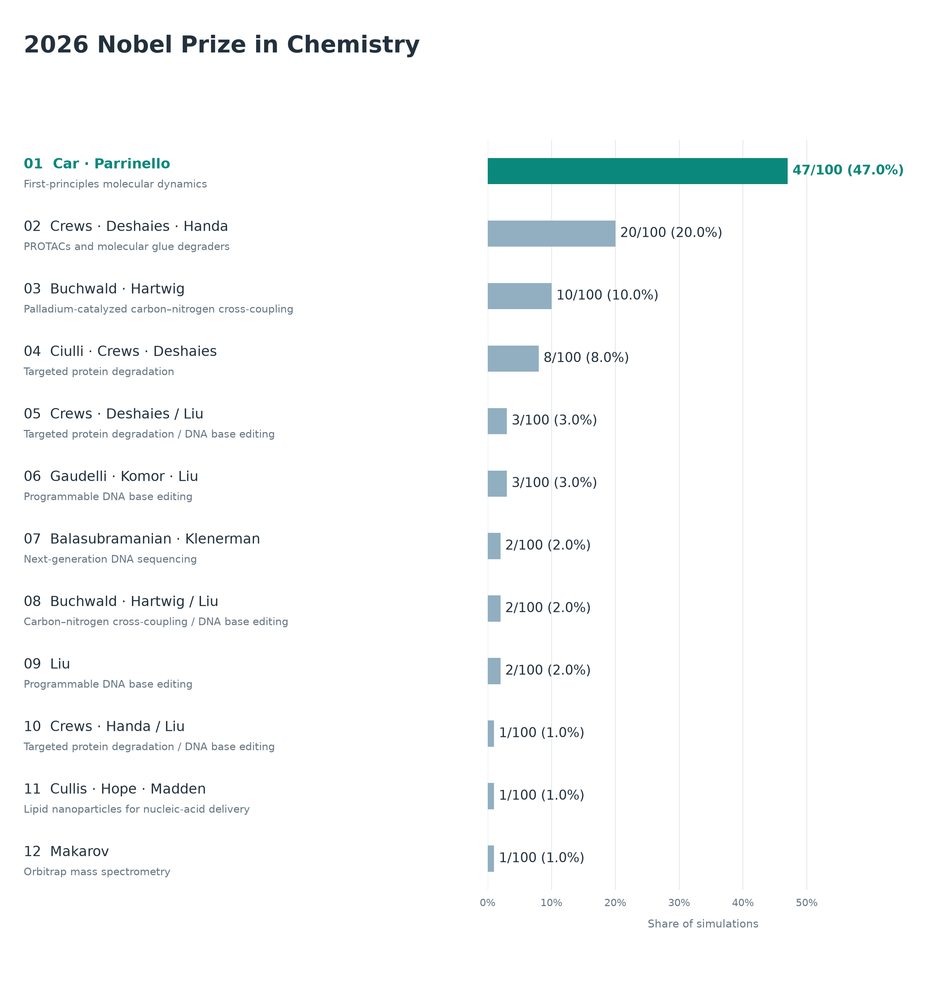
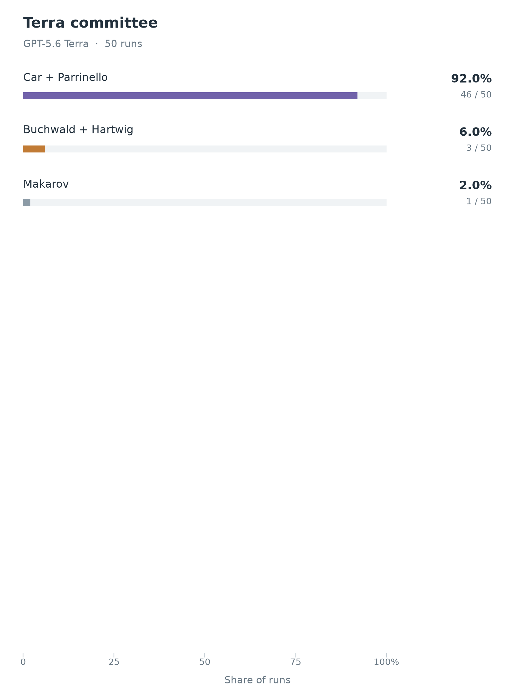
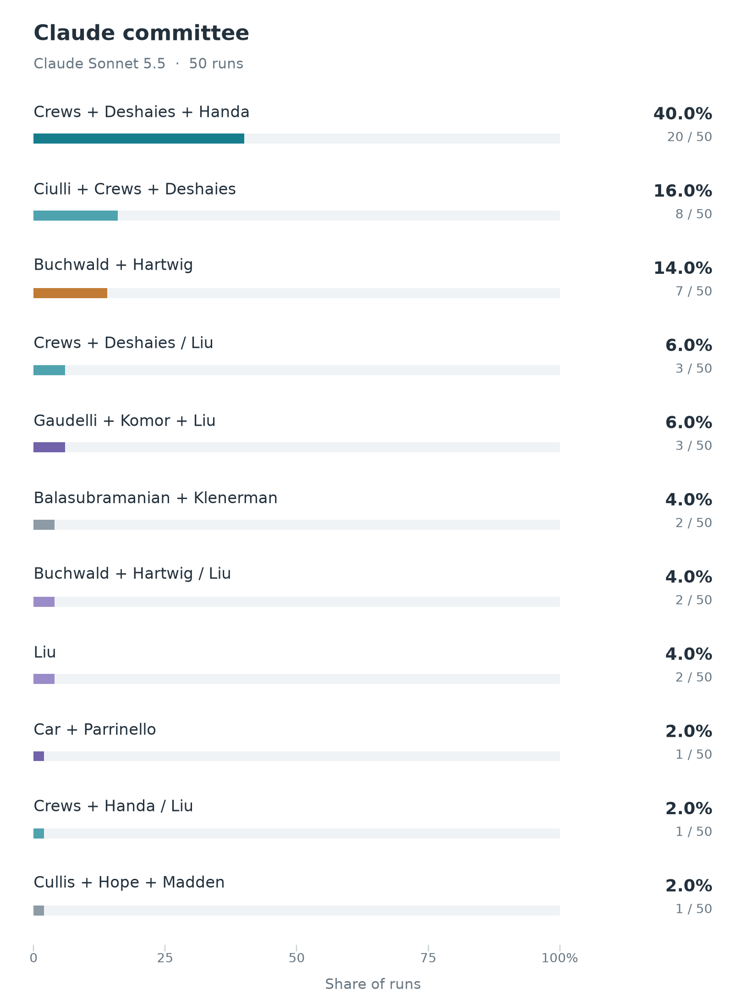

# Chemistry experiment details

## Aggregate simulation outcomes

The figure below shows all 12 winning configurations across the **100 committee simulations** pooled in the main forecast. Each model contributes 50 decisions. Counts and percentages are observed simulation outcomes, not calibrated probabilities of winning the prize. Split awards remain separate configurations; a slash separates their prize parts.



The main forecast shows five configurations. The fifth, Crews–Deshaies / Liu, is tied at three wins with Gaudelli–Komor–Liu; alphabetical label order breaks ties, as in the other forecast figures. Both appear in the full distribution.

## Simulation variants

The [Chemistry result](../../README.md#chemistry) aggregates **50 GPT-5.6 Terra and 50 Claude Sonnet 5.5 decisions**, both using high reasoning effort. Eight simulated committee members review a shuffled candidate list, take part in two discussion rounds, and cast ranked private ballots. All eight vote; a majority is five. Conflicts are disclosed but not adjudicated. The [protocol](../../docs/PHYSICS_PHASE2.md) describes the discussion and instant-runoff rules, adapted here to Chemistry without a nomination stage.

Terra uses a reduced pool of **52 discoveries**; Claude uses the original **69 discoveries**. Both include Car–Parrinello molecular dynamics and targeted protein degradation with the same credited-name pools. The models also have different profile allocations, so their outcome differences cannot be attributed solely to the model.

Terra's five neutral profile versions have 13, 10, nine, nine, and nine simulations respectively. The first 13 were already dispatched before the additional variants were assigned. Versions 2–5 paraphrase documented background, change presentation, and remove unsupported personality and prize-preference inferences; version 1 retains some earlier interpretive caveats. Claude uses its original profiles, including persona sections, in 41 simulations and neutral Terra profile versions in nine (two each for versions 1–4 and one for version 5).

<table>
  <tr>
    <td align="center"></td>
    <td align="center"></td>
  </tr>
  <tr>
    <td align="center"><strong>GPT-5.6 Terra</strong></td>
    <td align="center"><strong>Claude Sonnet 5.5</strong></td>
  </tr>
</table>

## What drives the results

**The models select different leaders.** Terra awards Car–Parrinello molecular dynamics in 46 decisions, Buchwald–Hartwig coupling in three, and Orbitrap mass spectrometry in one. Claude awards targeted protein degradation alone in 28 decisions and shares it with base editing in four more. Its other outcomes are coupling (seven), base editing (five), coupling plus base editing (two), next-generation sequencing (two), lipid nanoparticles (one), and Car–Parrinello (one).

**Terra's preference survives changes in profile wording.** Car–Parrinello wins 12/13 simulations with version 1, 10/10 with version 2, 8/9 with version 3, 8/9 with version 4, and 8/9 with version 5. Giving each profile version equal weight produces 91.8% for Car–Parrinello, 6.0% for coupling, and 2.2% for Orbitrap. The main figures give each simulation equal weight, yielding 92%, 6%, and 2% respectively.

**Attribution changes the apparent ranking.** Protein degradation's 28 standalone wins divide into two recipient configurations: Crews–Deshaies–Handa (20) and Ciulli–Crews–Deshaies (eight). The figures display those separately, just as the Medicine forecast separates alternate GLP-1 recipient configurations. Claude also produces three Crews–Deshaies / Liu split awards and one Crews–Handa / Liu split award.

## Saved results and figure reproduction

The [final summary](final_summary.json) records every outcome, model and profile counts, equal-profile frequencies, and SHA-256 hashes of all 100 published decision snapshots in [committee](committee). All completed decisions were validated against their full local committee records and recomputed voting outcomes before publication. The published snapshots contain the final vote tally and winning proposal; the full discussion and runtime logs remain in the local experiment archive.

From the repository root, with Matplotlib installed, regenerate the four figures using:

```sh
python3 scripts/plot_chemistry_prediction_distributions.py
```

The plotting script checks every decision against its validated hash, requires 50 decisions per model, merges recipient-order differences, and keeps the denominator of 100 when displaying the top five.
