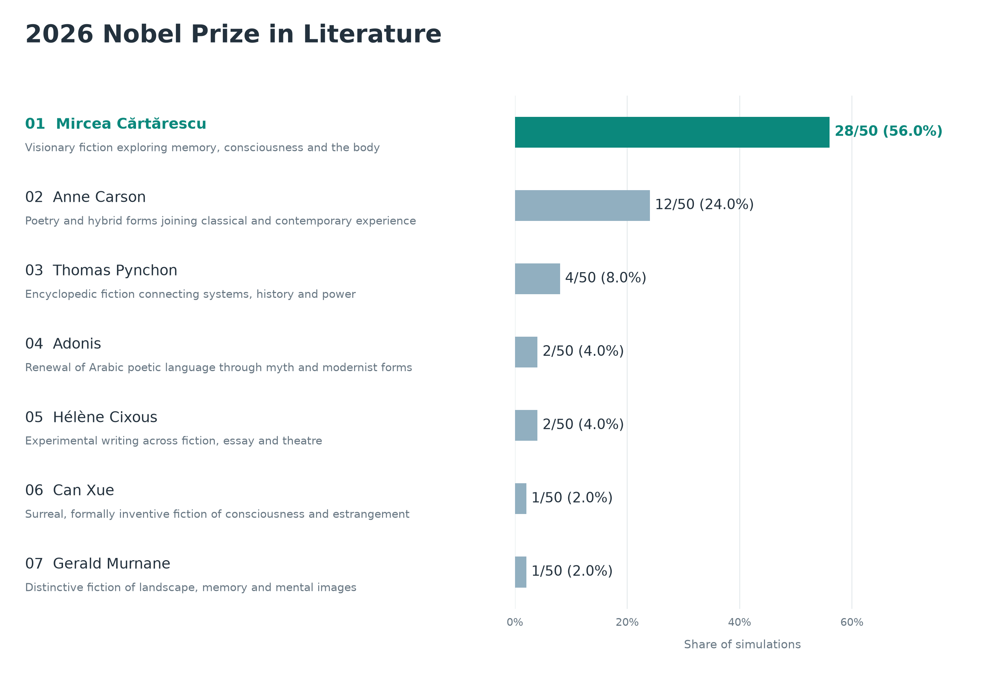
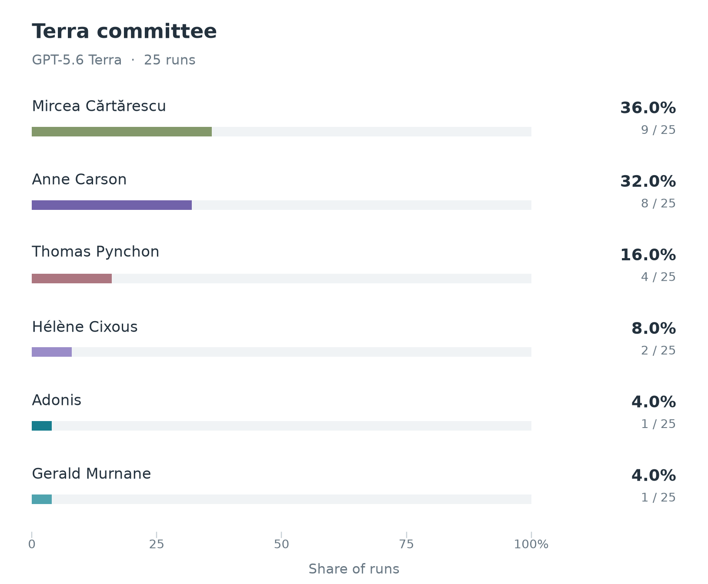
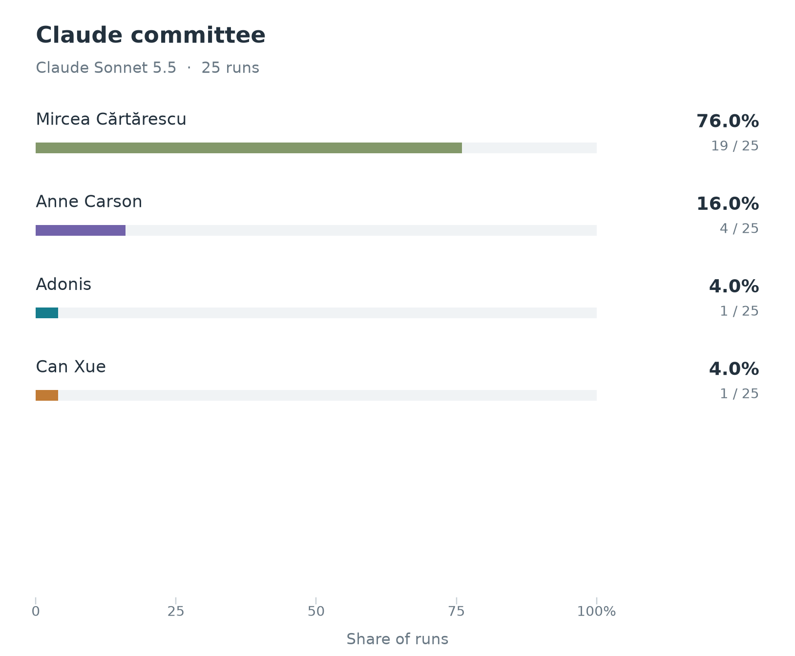
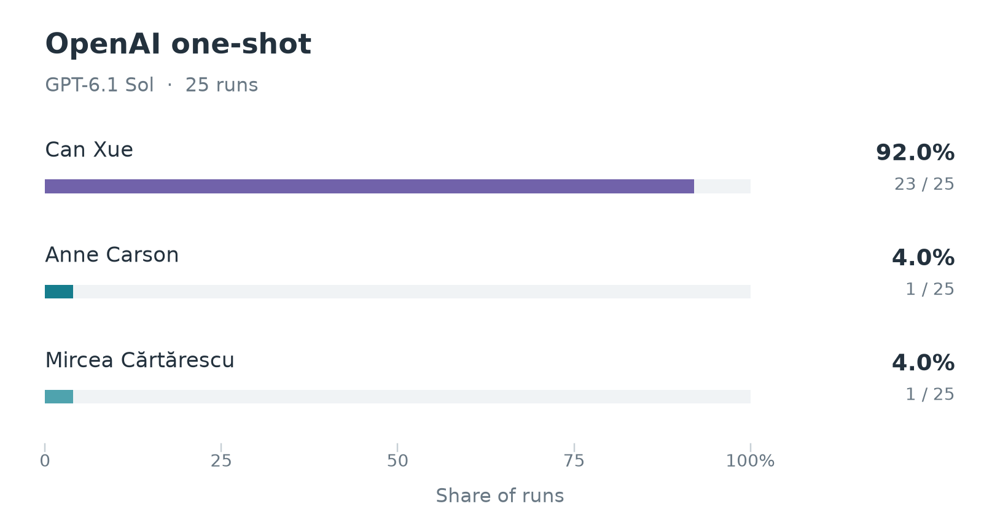
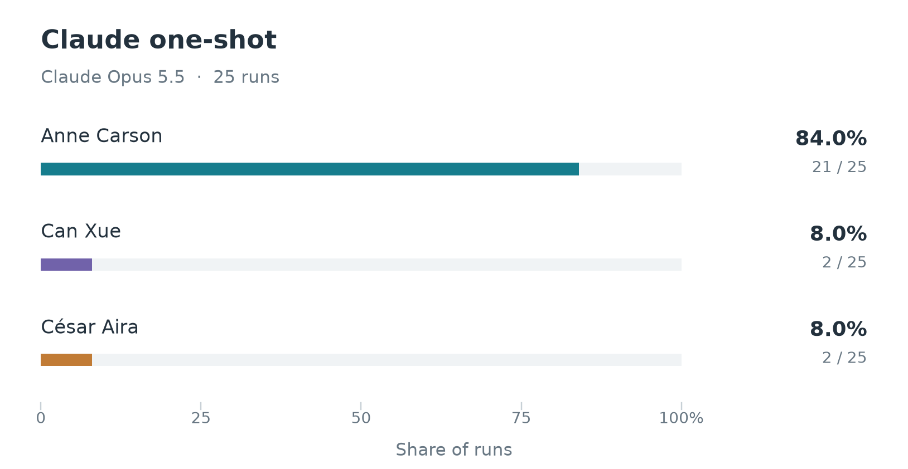

# Literature experiment results

All four arms are complete: **25 GPT-5.6 Terra committee simulations, 25 Claude Sonnet 5.5 committee simulations, 25 GPT-6.1 Sol one-shot forecasts and 25 Claude Opus 5.5 one-shot forecasts**, all with high reasoning effort. The committee aggregate counts 50 decisions; the one-shot answers are kept separate.

## Committee forecast

Mircea Cărtărescu leads the pooled committees with **28/50 outcomes (56%)**, followed by Anne Carson with **12/50 (24%)**. These are observed frequencies in this experiment, not calibrated probabilities of the real prize.



| Writer | GPT-5.6 Terra | Claude Sonnet 5.5 | Combined |
|---|---:|---:|---:|
| Mircea Cărtărescu | 9 | 19 | 28/50 (56%) |
| Anne Carson | 8 | 4 | 12/50 (24%) |
| Thomas Pynchon | 4 | 0 | 4/50 (8%) |
| Adonis | 1 | 1 | 2/50 (4%) |
| Hélène Cixous | 2 | 0 | 2/50 (4%) |
| Can Xue | 0 | 1 | 1/50 (2%) |
| Gerald Murnane | 1 | 0 | 1/50 (2%) |

<table>
  <tr>
    <td align="center"></td>
    <td align="center"></td>
  </tr>
</table>

**The models begin with different degrees of consensus.** Cărtărescu is ranked first in 98 of Claude’s 150 private opening rankings and 52 of Terra’s 150. Steve Sem-Sandberg ranks him first in 22/25 Claude committees and 18/25 Terra committees. This is a pattern in the saved simulations, not evidence of the real member’s preferences. Cărtărescu is shortlisted in every committee in both models. Terra’s chair is more dispersed: Anders Olsson starts with Adonis in 12/25 runs.

**Terra’s final vote is more divided.** Terra has 13 instant-runoff decisions, compared with 4 for Claude. Both models favor Cărtărescu overall, but Terra’s nine Cărtărescu selections are only one ahead of its eight Carson selections. Claude selects Cărtărescu in 19/25 runs.

## Profile variants

Both models use identical candidate inputs and identical factual profile versions, with matching shuffles in the 25 paired simulations. Each of the six members receives the same version throughout a simulation; every version has five repeats per model. Versions change headings and factual-block presentation while preserving retained facts, quotations and links. Persona instructions and unsupported preference inferences are removed uniformly.

| Profile version | GPT-5.6 Terra outcomes (five runs) | Claude Sonnet 5.5 outcomes (five runs) |
|---|---|---|
| v1 | Mircea Cărtărescu 3; Anne Carson 1; Thomas Pynchon 1 | Mircea Cărtărescu 4; Anne Carson 1 |
| v2 | Mircea Cărtărescu 2; Thomas Pynchon 2; Anne Carson 1 | Mircea Cărtărescu 4; Can Xue 1 |
| v3 | Anne Carson 2; Gerald Murnane 1; Hélène Cixous 1; Thomas Pynchon 1 | Mircea Cărtărescu 4; Anne Carson 1 |
| v4 | Mircea Cărtărescu 3; Anne Carson 2 | Mircea Cărtărescu 4; Anne Carson 1 |
| v5 | Anne Carson 2; Adonis 1; Hélène Cixous 1; Mircea Cărtărescu 1 | Mircea Cărtărescu 3; Adonis 1; Anne Carson 1 |

Claude’s leading writer remains Cărtărescu with every profile version. Terra’s third version produces no Cărtărescu selections, despite keeping the same retained facts. Five repeats per version are enough to expose variation here, but do not establish that a particular wording change caused an outcome. With equal sample sizes, pooling gives each profile version equal weight.

## One-shot comparison

Sol and Opus received the same direct Literature question, with no candidate list, committee profiles, discussions, browsing or tools. Each forecast used a fresh session. Sol returned free-form text; Opus also received a system instruction requesting JSON output. Only the explicit primary pick is counted.

<table>
  <tr>
    <td align="center"></td>
    <td align="center"></td>
  </tr>
</table>

| Writer | GPT-6.1 Sol | Claude Opus 5.5 |
|---|---:|---:|
| Can Xue | 23/25 (92%) | 2/25 (8%) |
| Anne Carson | 1/25 (4%) | 21/25 (84%) |
| Mircea Cărtărescu | 1/25 (4%) | 0/25 (0%) |
| César Aira | 0/25 (0%) | 2/25 (8%) |

**The one-shot models disagree, and neither leads with the committee favorite.** Sol favors Can Xue and Opus favors Anne Carson. Both writers, Cărtărescu and Aira are available in the common 50-writer committee pool, so their inclusion does not explain the difference. Can Xue reaches the shortlist in 15 Terra and 17 Claude committees but wins only once. Comparing these arms changes both the model and the context, so it does not isolate a causal effect of committee discussion.

## Design and interpretation

The [protocol](../../docs/LITERATURE_EXPERIMENT_DESIGN.md) simulates a **committee recommendation**, not the full Swedish Academy’s final vote. All six listed committee participants vote by explicit modeling assumption; a majority requires four. Whether co-opted Ingrid Carlberg votes inside the actual committee is undocumented. Each simulated award selects one writer and oeuvre.

Both cohorts use the same [50-writer Codex-curated input](../../agent-data/literature/candidates/codex/candidates.md), reduced from an archived 190-person coverage draft. A separate Claude candidate draft was not merged into this experiment. Selection criteria, contextual sources and all 140 removals are recorded beside the input. Original literary summaries and targeted eligibility checks retain their verification limitations. Forecasting judgments and market evidence do not appear in the blinded model packets. The experiment should be read with the [project’s Literature caveat](../../README.md#committee-discussion).

## Saved records and reproduction

- [Final committee summary](final_summary.json): all 50 outcomes, per-model and per-profile counts, opening/shortlist statistics, input-pairing checks, and decision/metadata SHA-256 hashes.
- [Committee records](committee): every opening ranking, shortlist, discussion round, chair summary, proposal slate, final ballot and decision from both models.
- [Sol one-shot records](oneshot/gpt-6.1-sol): the exact question manifest, all 25 requests and verbatim answers, execution/runtime records, source-bound primary-pick transcriptions and the [validated summary](oneshot/gpt-6.1-sol/posthoc_transcription_summary.json).
- [Opus one-shot records](oneshot/claude-opus-5-5): all 25 original JSON predictions, matching runtime records and the [validated summary](oneshot/claude-opus-5-5/final_summary.json).
- `runtime_audit.tar.gz`: the full committee request audit trails, including permitted evidence, embedded prompts, raw responses, runtime events and execution records. Extract from the repository root with `tar -xzf results/literature/runtime_audit.tar.gz -C .`; canonical committee records are already available without extraction.

All 50 committee decisions were validated against their full stage records and recomputed tallies. Sol transcriptions preserve exact primary-name strings and supporting excerpts and make no additional model calls. Opus predictions were matched to 25 distinct, tools-disabled runtime sessions with the locked model identity. The Codex CLI identifies the requested model but does not independently report a returned alias; that limitation is retained in the Sol summary.

With Python and Matplotlib installed, regenerate the summaries and figures from the repository root:

```sh
python3 scripts/summarize_literature_committees.py
python3 scripts/transcribe_literature_oneshot_sol.py
python3 scripts/summarize_literature_oneshot_claude.py
python3 scripts/plot_literature_results.py
```

The plotting script verifies every source hash and requires 25 records per model. The top-five display keeps the denominator of 50 and uses alphabetical label order to break ties; the full distribution displays all seven committee outcomes.
