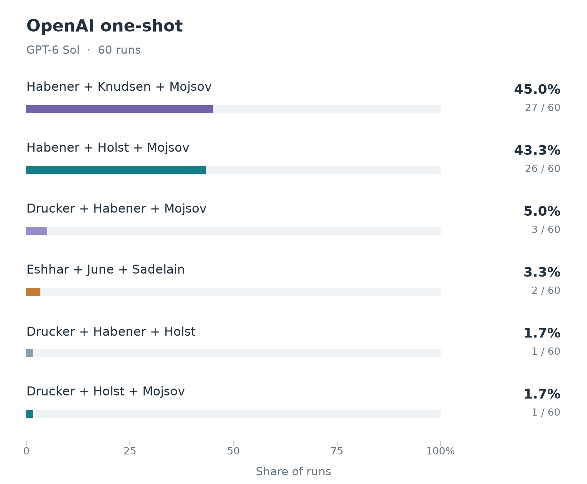

# Physiology or Medicine experiment details

## Simulation variants

The [Medicine result](../../README.md#physiology-or-medicine) aggregates **120 committee decisions**: 60 each from Claude Sonnet 5.5 and GPT-5.6 Terra. The nominator stage was skipped for Medicine; every committee receives the same [candidate list](../../agent-data/medicine/candidates/README.md) of 52 discoveries, in a different order per simulation. The six committee members read factual profiles, and all six vote.

<table>
  <tr>
    <td align="center"></td>
    <td align="center"></td>
  </tr>
  <tr>
    <td align="center"><strong>Claude Sonnet 5.5</strong></td>
    <td align="center"><strong>GPT-5.6 Terra</strong></td>
  </tr>
</table>

## Committee result breakdown

| Proposed recognition | Claude | Terra | Combined |
|---|---:|---:|---:|
| Drucker, Holst and Mojsov — GLP-1 | 56 | 29 | 85 |
| Lowy, Frazer and Schiller — HPV vaccines | 0 | 18 | 18 |
| Miller and Cooper — B- and T-cell lineages | 0 | 7 | 7 |
| Drucker, Holst and Knudsen — GLP-1 | 4 | 0 | 4 |
| Mori and Walter — unfolded protein response | 0 | 2 | 2 |
| Horwich and Hartl — chaperonin-assisted protein folding | 0 | 2 | 2 |
| Feldmann and Maini — TNF blockade | 0 | 1 | 1 |
| Lo — fetal cell-free DNA | 0 | 1 | 1 |
| **Total** | **60** | **60** | **120** |

## What drives the results

**The models enter discussion with different priors.** Claude puts GLP-1 first in 353 of 360 private openings (98.1%), then all six members support it in both discussion rounds of every simulation. Terra's opening preferences are much less concentrated: GLP-1 has 146 of 360 first places (40.6%), HPV vaccines 80 (22.2%), and B- and T-cell lineages 47 (13.1%). This difference appears before members see one another's arguments, so it accounts for most of the gap between the two outcome distributions.

**Discussion usually strengthens the opening plurality.** The Terra winner has at least a share of the opening plurality in 58 of 60 simulations, and is the unique opening leader in 47. By round 2 those figures rise to 59 and 53. Across the 360 Terra member trajectories, 35 preferences change between rounds 1 and 2; 33 changes move toward the eventual winner and none move away. Mean support for the eventual winner grows from 3.3 members at opening to 4.4 in round 2. The process generally resolves a divided field rather than producing an unrelated upset.

**The two leading Terra outcomes win differently.** HPV vaccines average 5.0 round-2 supporters in the 18 committees they win, with ten unanimous decisions and only two requiring an instant runoff. GLP-1 averages 4.3 supporters in its 29 wins and requires a runoff 11 times. HPV therefore tends to win when a strong consensus forms; GLP-1 can also survive a split first ballot and collect transfers as alternatives are eliminated. Overall, 42 Terra decisions have an immediate majority and 18 use at least one runoff round.

**Member backgrounds leave a visible but non-deterministic imprint.** Marie Wahren-Herlenius, whose documented field is autoimmunity and rheumatology, opens with B- and T-cell lineages in 18 simulations and TNF blockade in eight; chair Per Svenningsson opens with GLP-1 in 35. These are observed associations, not evidence of private preferences or proof that expertise caused the votes. Discussion substantially reduces these differences.

**The GLP-1 debate is mainly about credit.** Claude's 360 round-2 positions all support the same discovery, but 317 name Daniel Drucker, Jens Juul Holst and Svetlana Mojsov, while 43 substitute Lotte Bjerre Knudsen for Mojsov. That produces 56 Mojsov outcomes and four Knudsen outcomes. Every Terra GLP-1 winner uses the Mojsov configuration. The shared judgment concerns the achievement; the disagreement concerns whether the third seat should recognize identification of the active peptide or development of long-acting drugs.

The shuffled list order does not explain the headline result. Claude awards GLP-1 when it appears anywhere from position 1 to 49. In Terra, GLP-1's mean position is 26.5 when it wins and 24.2 when it loses, so earlier presentation does not increase its success in this sample.

## Example discussion

[Terra simulation 1](committee/gpt-5.6-terra/sim-01) shows how discussion can turn a weak plurality into consensus. The six private openings divide across five discoveries: unfolded protein response receives two first choices, while B- and T-cell lineages, leptin, GLP-1 and TNF blockade receive one each. Those positions remain unchanged in round 1.

The chair identifies unfolded protein response as the broadest position because five members either prefer it or retain it as an alternative. The central comparison is between a sharply bounded fundamental mechanism and discoveries with more direct clinical impact but wider attribution boundaries. In round 2, three members move to unfolded protein response, producing five supporters for Mori and Walter; Wahren-Herlenius retains TNF blockade. The final ballot is 5–1 for unfolded protein response, without a runoff.

## One-shot comparison

For comparison, we asked **GPT-6 Sol and Claude Opus 5.5** who would win, without simulating a committee or providing a candidate list. Each graph summarizes 60 independent answers.

<table>
  <tr>
    <td align="center"></td>
    <td align="center"></td>
  </tr>
</table>

Opus selects GLP-1 in all 60 answers; Sol selects it in 58 and CAR-T therapy in two. Across both arms, 117 of 120 answers include Joel Habener, who died in December 2025, after the models' knowledge cutoff. The committees work from a candidate list checked for living status, so they exclude him.
