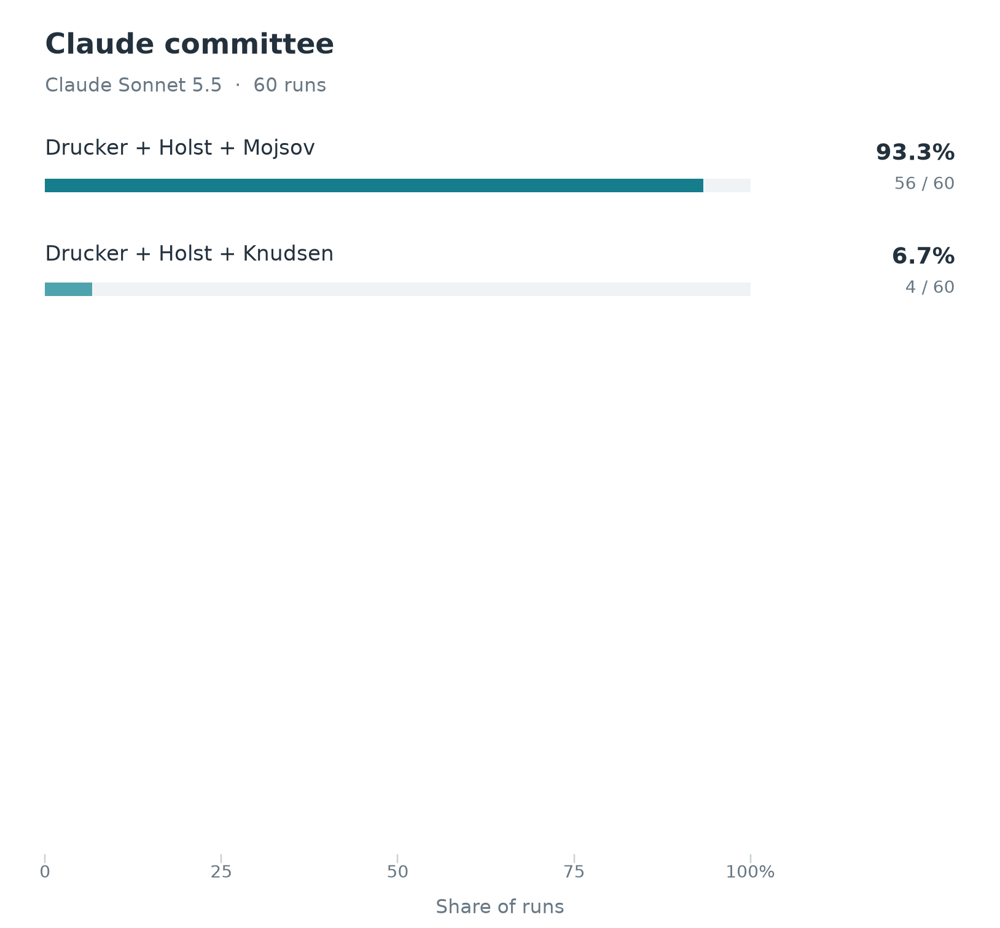
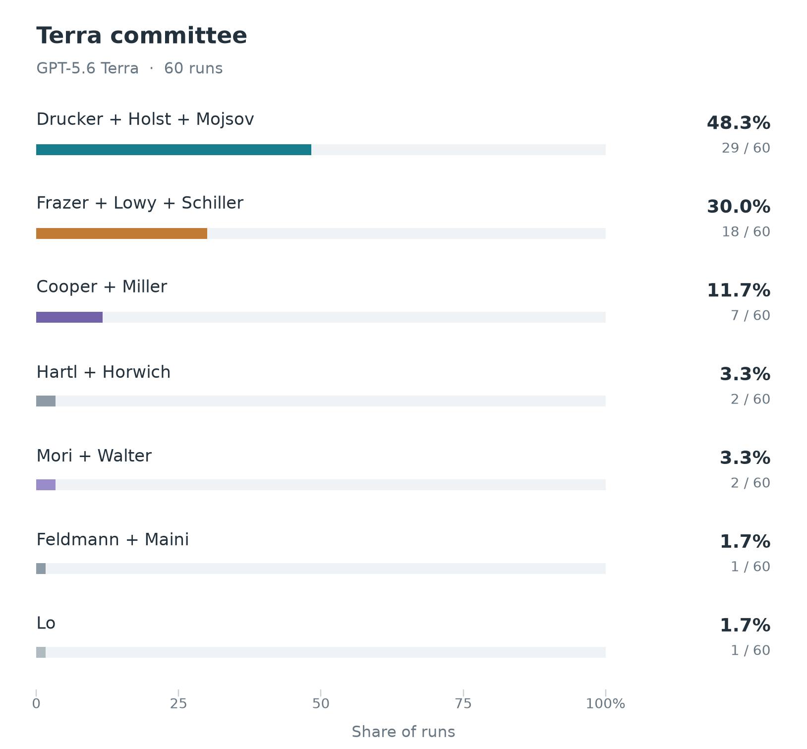
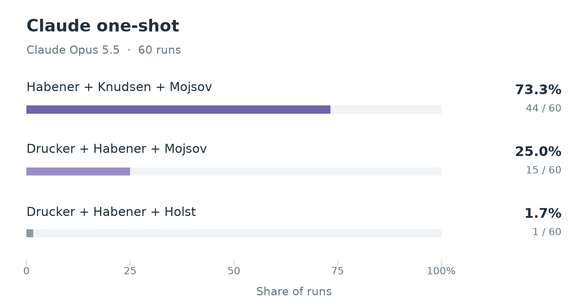

# Physiology or Medicine experiment details

## Simulation variants

The [Medicine result](../../README.md#physiology-or-medicine) aggregates **120 committee decisions**: 60 each from Claude Sonnet 5.5 and GPT-5.6 Terra. The nominator stage was skipped for Medicine; every committee receives the same [candidate list](../../agent-data/medicine/candidates/README.md) of 52 discoveries, in a different order per simulation. The six committee members read factual profiles, and all six vote.

<table>
  <tr>
    <td align="center"></td>
    <td align="center"></td>
  </tr>
  <tr>
    <td align="center"><strong>Claude Sonnet 5.5</strong></td>
    <td align="center"><strong>GPT-5.6 Terra</strong></td>
  </tr>
</table>

## One-shot comparison

For comparison, we asked **Claude Opus 5.5** who would win, without simulating a committee or providing a candidate list. The graph summarizes 60 independent answers.

<table>
  <tr>
    <td align="center"></td>
  </tr>
</table>

Every one-shot answer is GLP-1, and every one includes Joel Habener, who died in December 2025, after the model's knowledge cutoff. The committees work from a candidate list checked for living status, so they give his share to Holst or Drucker.

Additional slates appearing in this comparison:

- **Joel Habener, Lotte Bjerre Knudsen, and Svetlana Mojsov** for GLP-1 and the development of GLP-1-based therapies.
- **Daniel J. Drucker, Joel Habener, and Svetlana Mojsov** for the discovery of GLP-1 and its physiology.
- **Daniel J. Drucker, Joel Habener, and Jens Juul Holst** for GLP-1 physiology.
