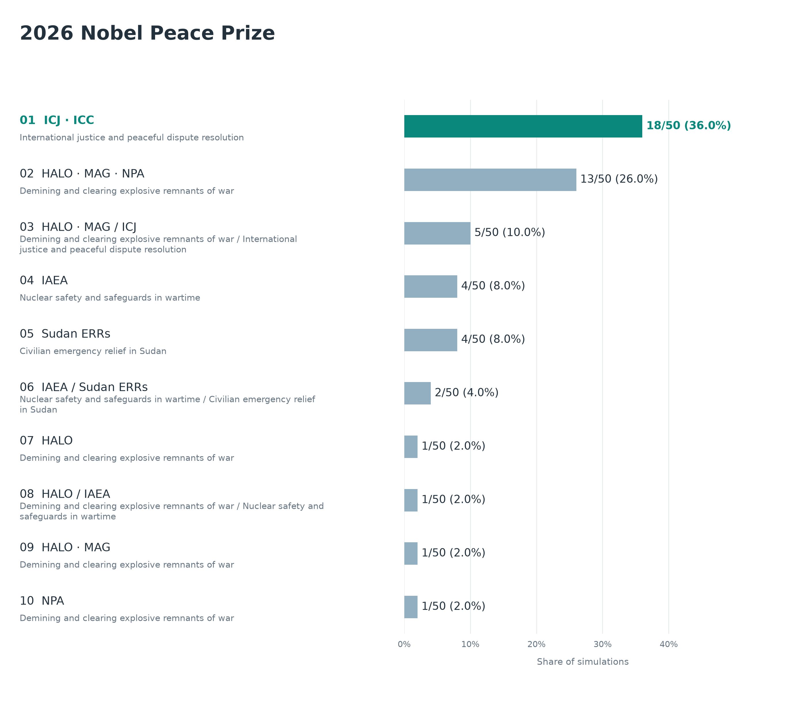
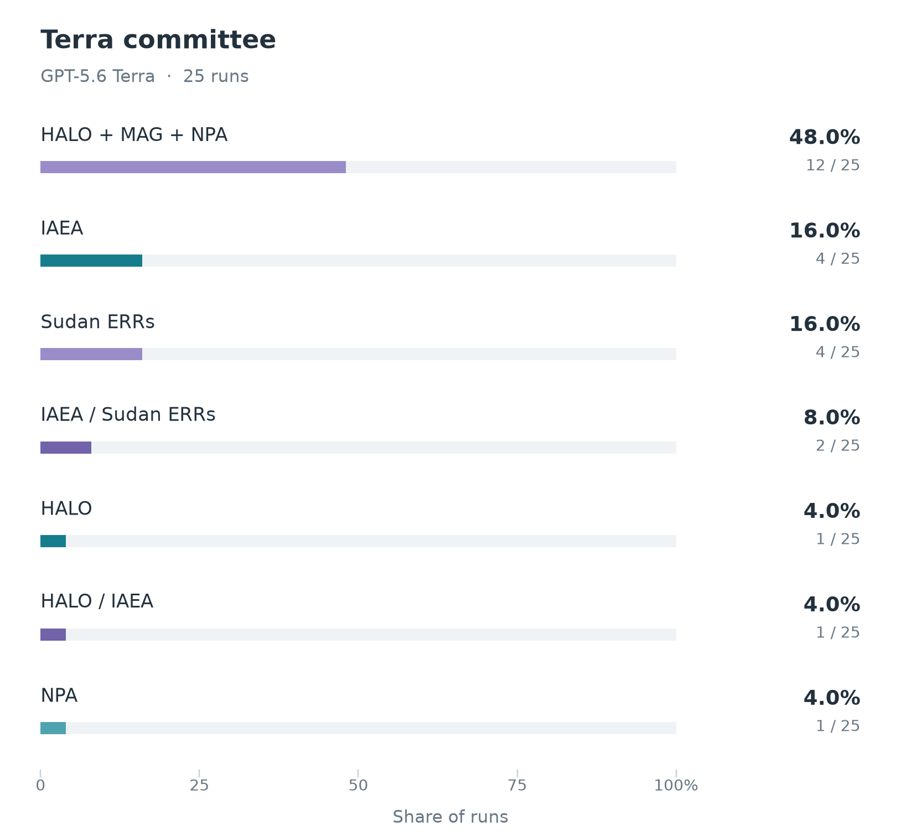
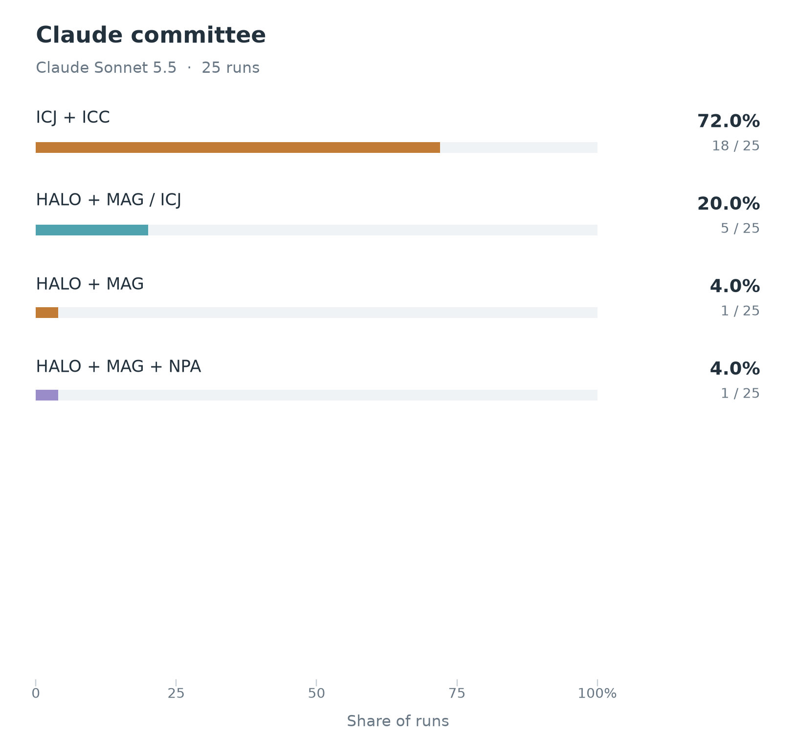
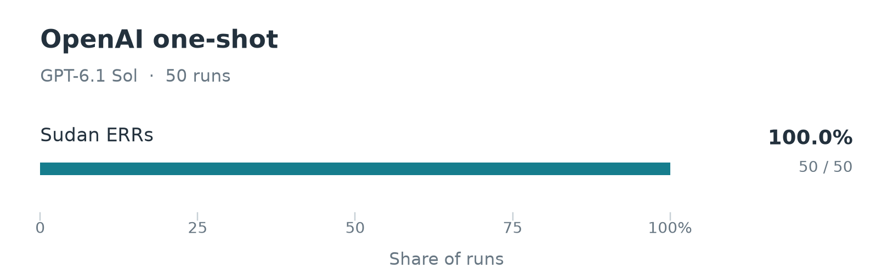

# Peace experiment details

## Aggregate simulation outcomes

The figure below shows all ten winning configurations across **50 committee simulations**: 25 GPT-5.6 Terra and 25 Claude Sonnet 5.5 decisions. Counts and shares describe simulation outcomes, not calibrated probabilities of winning the prize. A slash separates split-prize parts; alternate recipient configurations remain separate.



Figure abbreviations: **ICJ** = International Court of Justice; **ICC** = International Criminal Court; **HALO** = HALO Trust; **MAG** = Mines Advisory Group; **NPA** = Norwegian People's Aid; **IAEA** = International Atomic Energy Agency; **Sudan ERRs** = Sudan's Emergency Response Rooms. IAEA and Sudan ERRs are tied at four wins, with alphabetical figure-label order breaking the tie.

## Simulation variants

The [main Peace forecast](../../README.md#peace) gives each completed committee decision equal weight. Both models use high reasoning effort, the same [47-entry candidate list](../../agent-data/peace/candidates/README.md), and the same five neutral profile versions. Each profile version has five repetitions per model. The same-numbered Terra and Claude simulations receive identical blinded candidate packets and list order. Five committee members participate: chair Jørgen Watne Frydnes, Asle Toje, Anne Enger, Kristin Clemet and Gry Larsen. Secretary Kristian Berg Harpviken is non-voting and absent from the simulated discussion. A majority requires three votes.

The nominator stage is omitted. Each committee reviews shuffled achievement-centered entries, conducts two discussion rounds with a chair synthesis between them, and casts exhaustive private rankings over a deterministic proposal slate. The final choice uses instant runoff. Recipient pools may exceed three, but a winning award names at most three individuals and/or organizations. Conflicts are disclosed but do not alter the simulation's voting roster.

The [profile versions](../../agent-data/peace/committee/terra_profiles.md) change headings, section order and paragraph presentation while preserving factual wording, quotations, source links and caveats. They uniformly omit prescriptive personas and unsupported deductions about voting preferences. The `profile_terra_vN.md` files are used by **both models**. See the [experiment design](../../docs/PEACE_EXPERIMENT_DESIGN.md) for stage isolation, input hashes and reproduction commands.

<table>
  <tr>
    <td align="center"></td>
    <td align="center"></td>
  </tr>
  <tr>
    <td align="center"><strong>GPT-5.6 Terra</strong></td>
    <td align="center"><strong>Claude Sonnet 5.5</strong></td>
  </tr>
</table>

## What drives the results

**The model split is already visible in private openings.** Claude ranks the international-courts achievement first in 78 of 125 opening ballots (62.4%), followed by demining in 30 (24%). Terra's 125 openings divide mainly among demining (41; 32.8%), IAEA (35; 28%) and Sudan's Emergency Response Rooms (32; 25.6%). It puts the courts first only three times (2.4%). Because these rankings precede discussion and use matched inputs, the gap begins in independent model judgments.

**The committees converge on different configurations.** Claude selects the ICJ–ICC pair in 18 of 25 decisions (72%), a split ICJ/HALO–MAG award in five (20%), the HALO–MAG pair once, and the demining trio once. Terra selects the trio in 12 decisions (48%), Sudan ERRs alone in four (16%), IAEA alone in four (16%), Sudan ERRs plus IAEA in two (8%), and three other demining configurations once each. Each model reaches an immediate majority in 24 of 25 final ballots; only one decision per model requires a runoff.

**Demining provides common ground, while courts remain model-specific.** The demining achievement appears in 15 Terra and seven Claude winning configurations (22/50). The courts appear in 23/50, all Claude. These achievement-inclusion counts overlap when a prize is split; they should not be summed as if they were exclusive outcomes. Terra also includes IAEA in seven awards and Sudan ERRs in six, counting shared configurations.

**Member-level patterns also differ between models.** Terra's Asle Toje puts IAEA first in 22/25 openings; Anne Enger puts demining first in 16/25; Gry Larsen puts Sudan ERRs first in 17/25. Claude's Kristin Clemet puts the courts first in 22/25 and its Toje does so in 17/25. These are observed simulation associations, not claims about the actual members' preferences.

**Presentation changes the concentration of outcomes.** The table tracks the two leading exact recipient configurations; the other decisions retain the alternatives shown in the full figure.

| Neutral profile version | Terra: HALO–MAG–NPA | Claude: ICJ–ICC |
|---|---:|---:|
| 1 | 1/5 | 2/5 |
| 2 | 2/5 | 4/5 |
| 3 | 3/5 | 4/5 |
| 4 | 1/5 | 3/5 |
| 5 | 5/5 | 5/5 |

Giving profile versions equal weight produces the same frequencies as the pooled results because every version has five complete runs. The stronger concentration in version 5 is a presentation-sensitivity finding; five repetitions per version are too few to establish a general causal effect of ordering.

## One-shot comparison

For comparison, we asked **GPT-6.1 Sol/high** who would win, without providing a candidate list or simulating a committee. The 50 independent forecasts used fresh sessions with browsing and all other tools disabled. Each received only the [versioned Peace question](../../prompts/peace_oneshot_gpt_6_1_sol_v1.txt).



**Sol selects Sudan's Emergency Response Rooms in all 50 answers (100%).** Each predicts the civilian aid network as the organizational recipient, for locally organized relief and solidarity during Sudan's civil war. The complete answers remain available verbatim; their primary predictions were transcribed with exact supporting excerpts and response hashes. All 50 requests have distinct conversation IDs and no observed tool use.

**The one-shot result differs from both committee leaders.** Sudan ERRs wins four standalone committee awards (8% of the 50-decision aggregate) and shares two awards with IAEA (4%), all from Terra. It wins no Claude committee decision, despite being available in the common candidate pool. The one-shot unanimity therefore does not reproduce either Claude's preference for the courts or Terra's preference for demining. This comparison changes both the model and the setup, so it cannot isolate the effect of committee discussion. Repeated agreement is not a calibrated real-world winning probability.

The one-shot answers are **not included** in the 50-decision committee aggregate. The [transcription summary](oneshot/gpt-6.1-sol/posthoc_transcription_summary.json) links every count to its prediction ID and source hashes. The [saved experiment](oneshot/gpt-6.1-sol) includes all 50 verbatim responses, request records, execution records, runtime events, [primary-pick transcriptions](oneshot/gpt-6.1-sol/transcriptions.json), and validated structured results. The recorded returned-model field follows the requested Codex CLI model; the runtime does not independently expose a returned model alias.

## Saved results and figure reproduction

The [final summary](final_summary.json) records all ten outcomes, per-model and per-profile counts, opening first choices, round-two configurations, runoff counts and SHA-256 hashes of all 50 decision snapshots in [committee](committee). Every decision was validated against its complete local discussion, slate, ballots and recomputed tally before publication. Published decision snapshots preserve the final tally and winning recipients; full discussion files and request runtime logs remain in the local experiment archive.

Regenerate the published committee figures with:

```sh
python3 scripts/plot_peace_prediction_distributions.py
python3 scripts/plot_peace_oneshot.py
```

The plotting script verifies every decision hash against the summary. `scripts/summarize_peace_committees.py` rebuilds the summary when the complete local committee archive is available. The [experiment design](../../docs/PEACE_EXPERIMENT_DESIGN.md) describes the run layout and validation checks.
