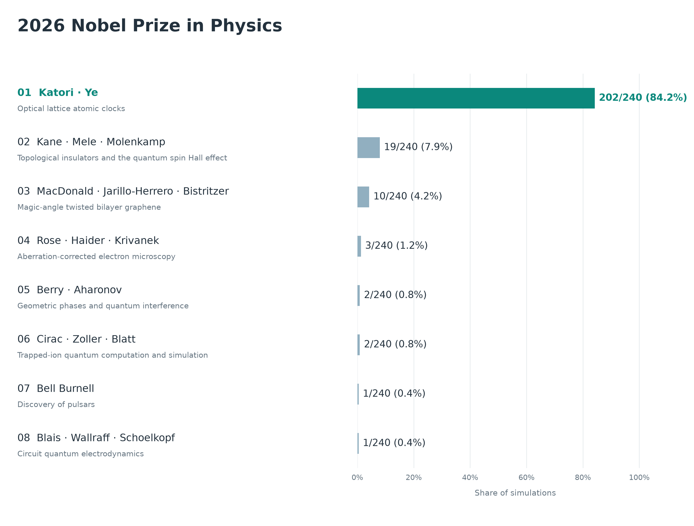
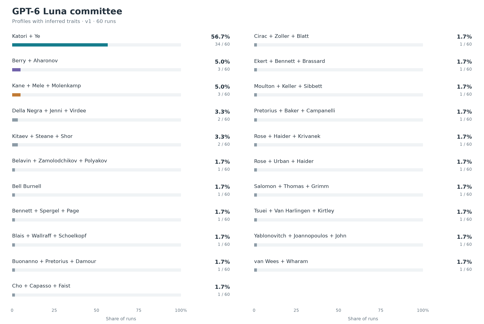

# Physics experiment details

## Aggregate simulation outcomes

The figure below shows all eight winning configurations across the **240 committee simulations** pooled in the main forecast. Counts and percentages are observed simulation outcomes, not calibrated probabilities of winning the prize.

## Simulation variants

The [Physics result](../../README.md#physics) pools four experiments: **GPT-5.6 Terra and Claude Sonnet 5.5, each with v1 and v2 profiles**. Each experiment combines 12 candidate lists and five fresh committees per list: **60 decisions per experiment, 240 in total**. Those lists come from six nomination runs for each of two independently drafted nominator lists. **v1** profiles combine documented background with inferred personality traits and selection preferences. **v2** removes those inferences, providing a more reliable factual basis for representing the members with fewer assumptions about their preferences. Candidate lists and discussion rules are the same. The plots show v2 first, then v1.

<table>
  <tr>
    <td align="center"></td>
    <td align="center"></td>
  </tr>
  <tr>
    <td align="center"></td>
    <td align="center"></td>
  </tr>
</table>

## Luna comparison

GPT-6 Luna uses v1 profiles for 60 committee decisions. These results are shown separately from the aggregate.

## One-shot comparison

For comparison, we asked **GPT-6.1 Sol and Claude Opus 5.5** who would win, without simulating a committee. Each graph summarizes 60 independent answers.

<table>
  <tr>
    <td align="center"></td>
    <td align="center"></td>
  </tr>
</table>

Additional slates appearing in this comparison:

- **John Pendry and David R. Smith** for electromagnetic metamaterials, negative refraction, and transformation optics.
- **John Pendry, David R. Smith, and Ulf Leonhardt** for metamaterials and transformation optics, including optical cloaking proposals.
- **John Pendry, David R. Smith, and Nader Engheta** for metamaterials and engineered electromagnetic response.
- **Ignacio Cirac, Immanuel Bloch, and Peter Zoller** for quantum simulation of many-body physics with ultracold atoms in optical lattices.
- **Eli Yablonovitch and Sajeev John** for photonic crystals and photonic band gaps that control light propagation.
- **Eli Yablonovitch, Sajeev John, and John Pendry** for photonic band-gap crystals and metamaterials for controlling light.

## Example discussion

One complete simulation, chosen because the committee starts split and the vote goes to an instant runoff: Claude Sonnet 5.5 with v2 profiles, on run 2 of the Claude-drafted nominator list. The **[full transcript](example_committee_transcript.md)** reproduces every opening assessment, statement, chair summary and ballot verbatim; the raw records are in [`claude-opus-5-5/run-2/committee/claude-profile-v2/sim-05`](claude-opus-5-5/run-2/committee/claude-profile-v2/sim-05). The summary below follows it step by step.

**1. Private openings.** Each member ranks eight of the 45 candidates without seeing anyone else. Their first choices spread across seven different achievements:

| Member | Opening #1 |
|---|---|
| Danielsson | Gamma-ray burst afterglows |
| Eriksson | Dynamical mean-field theory |
| Johansson | Circuit quantum electrodynamics |
| Kröll | Optical lattice clocks |
| Lindroth | Optical lattice clocks |
| Mehlig | Fluctuation theorems |
| Olsson | Magic-angle twisted bilayer graphene |
| Pearce (chair) | IceCube astrophysical neutrinos |

The support rule turns these into a ten-candidate shortlist.

**2. Round 1.** Members read all openings and propose a prize. Four back the lattice clock (Katori and Ye), two of them pairing it with IceCube for Halzen. Eriksson and Olsson back magic-angle graphene, Johansson circuit QED and Mehlig topological insulators. Members argue with named colleagues; for example, Eriksson makes the case for graphene but concedes that "the discovery is only eight years old" and the superconductivity mechanism is still debated. Mehlig replies to Olsson that topological insulators are distinct from the 2016 prize and that he would rather wait on graphene.

**3. Chair summary.** Pearce records the partial convergence on clocks and sets questions for round 2, including whether the lattice clock is distinct from the 2005 and 2012 prizes, and whether a one-name IceCube credit for Halzen is defensible.

**4. Round 2.** Johansson switches from circuit QED to clocks:

> "The magic-wavelength lattice is a distinct idea: it removes Doppler, recoil and first-order light-shift errors while interrogating many atoms at once, which the 2005 comb and 2012 single-ion prizes did not do."

The other members keep their round-1 positions.

**5. Proposal slate.** The round-2 positions are grouped into four proposals plus no award:

| Proposal | Prize | Round-2 supporters |
|---|---|---|
| P001 | Lattice clocks (Katori, Ye) | Johansson, Kröll, Lindroth |
| P002 | IceCube (Halzen) + lattice clocks (Katori, Ye) | Danielsson, Pearce |
| P003 | Magic-angle graphene (MacDonald, Jarillo-Herrero, Bistritzer) | Eriksson, Olsson |
| P004 | Topological insulators (Kane, Mele, Molenkamp) | Mehlig |
| P000 | No award | — |

**6. Private final ballots and instant runoff.** Each member ranks every proposal. Kröll's ballot also records a possible conflict, his research stay in John Hall's lab, but conflicts are disclosed, not adjudicated, so every ballot counts.

| Round | P001 clocks | P002 IceCube + clocks | P003 graphene | P004 topological insulators | Eliminated |
|---|---|---|---|---|---|
| 1 | 3 | 2 | 2 | 1 | No award (0 votes) |
| 2 | 3 | 2 | 2 | 1 | P004 |
| 3 | 4 | 2 | 2 | — | P002 (tie with P003, fewer Borda points) |
| 4 | **6** | — | 2 | — | **P001 wins** |

Mehlig's second choice moves his vote to clocks, and Danielsson and Pearce, whose joint IceCube proposal is eliminated, rank the clocks-only prize next. **Result: Hidetoshi Katori and Jun Ye**, from three first-preference votes to a 6–2 majority.
